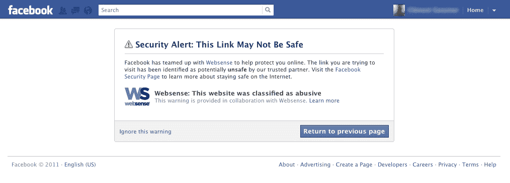

# 脸书与 Websense 合作，保护用户免受恶意网站和恶意软件的攻击 

> 原文：<https://web.archive.org/web/https://techcrunch.com/2011/10/03/facebook-partners-with-websense-to-protect-users-from-malicious-sites-and-malware/>

脸书[宣布](https://web.archive.org/web/20230203161430/http://www.marketwire.com/press-release/webtrends-releases-first-its-kind-facebook-scoring-system-evaluate-performance-posts-1567811.htm)今天与安全公司 [Websense](https://web.archive.org/web/20230203161430/http://www.websense.com/) 合作，以保护其用户免受导致恶意网站和恶意软件站点的危险链接。今后，当脸书用户点击一个链接时，新系统将首先根据 Websense 的系统检查该链接，以确定它是否安全。

如果不是，将显示一条消息，警告用户该链接可能有害，并建议您返回上一页。

“返回上一页”按钮位于消息的右下角，非常突出，巧妙地鼓励用户选择该选项。然而，对于那些选择承担风险的人来说，左侧有一个更小的“忽略此警告”选项。

邮件中还包含有关链接为何被标记为可疑的信息。

正在使用的系统由 Websense 的“ThreatSeeker Cloud”提供支持，这是一个安全公司的分类和恶意软件识别平台。该公司表示，它能够使用自己的专有技术“高级分类引擎”(ACE)实时分析威胁。使用 ACE，Websense 不仅可以阻止已知的恶意软件网站，还可以阻止系统以前从未遇到过的恶意软件网站。它甚至可以阻止缩短的网址，比如那些使用 [bit.ly](https://web.archive.org/web/20230203161430/http://bit.ly/) 截断的网址， [Websense 于 2009 年 11 月与该公司合作](https://web.archive.org/web/20230203161430/https://techcrunch.com/2009/11/30/bit-ly-spam/)。

应该注意的是，这不是脸书防范恶意链接的唯一安全机制。[5 月](https://web.archive.org/web/20230203161430/https://techcrunch.com/2011/05/12/facebook-parters-up-with-web-of-trust-to-warn-users-about-malicious-links/)，这家社交网站与众包信誉管理服务[信任网](https://web.archive.org/web/20230203161430/http://www.mywot.com/)合作，提供类似的保护。将继续在脸书运营的信任网也会检查链接是否被归类为垃圾邮件、恶意软件或网络钓鱼，并给出自己的警告信息。然而，信任网依赖于安装了其网络浏览器扩展的用户社区的提交，而不是 Websense 解决方案中使用的实时技术。

该公司称，脸书也有自己专有的恶意网址数据库和其他手段来阻止网站上的恶意活动。

这不是 Websense 第一次涉足脸书保护。该公司还提供了一款名为 [Defensio](https://web.archive.org/web/20230203161430/http://www.websense.com/content/facebook.aspx) 的脸书应用，允许脸书页面所有者控制张贴到他们墙上的链接种类。Defensio 不仅可以防御恶意内容，还可以配置为阻止各种 URL 类别，包括性、赌博、毒品、仇恨言论、暴力等。

脸书将从今天开始向其 8 亿用户提供更多保护。