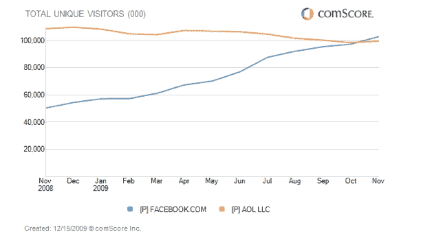

# 脸书在美国超过美国在线

> 原文：<https://web.archive.org/web/https://techcrunch.com/2009/12/15/facebook-passes-aol/>

# 脸书超过美国在线

就在上周，美国在线庆祝其作为独立交易公司的重新崛起。但它的一个主要优势是，它仍然拥有大量的受众，事实上，直到上个月，它还是美国第四大网站。ComScore 2009 年 11 月的数据显示，脸书以 1.029 亿的独立访问者数量超过了 Aol，而 Aol 只有 9970 万。

尽管自 2009 年 10 月以来，Aol 的独立访问者增长了近 100 万，但脸书的增长超过了 500 万。自 2008 年 11 月以来，脸书在美国的观众人数同比增长了 104%(从 5050 万人次)。在同一时期，Aol 的观众减少了 8%。这种下降令华尔街担忧。

早在 2009 年 2 月，脸书就已经在全球范围内超过了美国在线，并在去年夏天成为全球第四大网站，当时它比维基百科和其他维基媒体基金会网站更受欢迎。脸书要多久才能赶上微软的 1.36 亿美国访客、雅虎的 1.6 亿美国访客或谷歌的 1.68 亿美国访客？

或者蒂姆·阿姆斯特朗能扭转局势，重新夺回 AOL 在网络领域的地位吗？