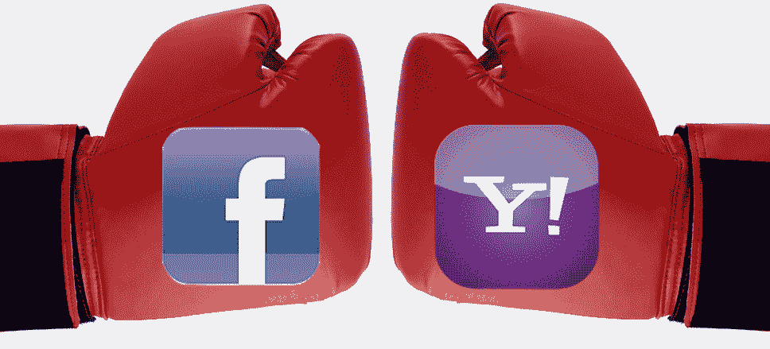

# 脸书没有付钱给雅虎，而是建立了一座拥有 1400 项专利的堡垒 

> 原文：<https://web.archive.org/web/https://techcrunch.com/2012/04/23/facebook-patent-fortress/>

脸书需要做出选择:在 2012 年初，它名下只有 56 项专利，它可以用巨额资金支付雅虎的侵权诉讼，并在其他专利攻击面前保持脆弱，或者对知识产权投资组合进行长期投资，以便在未来几年保护自己。

脸书明智地选择了第二条道路，通过今天 5 . 5 亿美元的现金购买和今天从微软获得的 650 项 AOL 专利授权，将其专利储备增加到 1400 多项。据直接了解此次购买的消息人士称，这些新专利涵盖了电子邮件、即时消息、网页浏览、搜索、广告、手机和电子商务。

当然，如果脸书不那么绝望的话，它可能会从微软那里得到这个缓存 [和从 IBM 购买的 750 个专利包](https://web.archive.org/web/20221209203912/http://money.msn.com/business-news/article.aspx?symbol=US:MSFT&feed=PR&date=20120423&id=15016651)[的更好的交易，但是迟做总比不做好。现在，有了我在下面分解的健康的专利组合，脸书也许能够停止争先恐后地购买知识产权，并能抵御任何破坏和从其首次公开募股中吸金的人的攻击。](https://web.archive.org/web/20221209203912/http://newsroom.fb.com/Announcements/Microsoft-Facebook-Announce-Patent-Agreement-14d.aspx)

事实上，脸书早在一年前就应该预料到专利诉讼的冲击，并加强防御。以如此小的知识产权投资组合大胆进行首次公开募股是鲁莽的，也可能是过于信任了。它从惠普、Friendster、英国电信和哈里伯顿等公司购买了一些专利，但几个月前公开持有的专利只有大约 60 项。也许它认为其他科技巨头会有更多的顾虑，但它实际上是将 1000 多亿美元的价值堆在一辆摇摇晃晃的人力车上，而不是装甲车上。

然而，幸运的是，雅虎攻击得有点太早了，在三月中旬宣布将起诉脸书十项关于社交网络、通信、隐私和广告的模糊专利。脸书迅速采取行动，于 3 月 22 日从 IBM 手中购买了[750 项专利。因为这些都是在紧急状态下购买的，IBM 可能可以获得比和平时期更高的价格，但脸书已经走投无路，时间和选择有限。](https://web.archive.org/web/20221209203912/https://beta.techcrunch.com/2012/03/22/facebook-buys-750-ibm-patents-to-defend-against-yahoo/?grcc=33333Z98)

今年 4 月，脸书对雅虎提起了精心策划的反诉，指控雅虎从学术界和企业家那里购买了包括马克·扎克伯格和一名前雅虎员工在内的 10 项专利。这是一个狡猾的举动，抵消了雅虎的攻击，同时仍然让脸书看起来像受害者。

关于脸书购买微软专利，雅虎给我们的声明是:

> “今天的行动改变不了脸书继续侵犯我们专利的事实。购买专利的公司通常处于弱势地位，并采取这些行动来加强他们的投资组合。我们认为今天的声明证实了我们对脸书的指控。”

脸书很可能不得不再次支付高价，这一次向微软支付了 5.5 亿美元现金，购买了微软上周以 10 亿美元从美国在线(AOL)手中购买的 925 项专利中的 650 项。微软达成了一笔大交易，因为它将保留出售给脸书的所有专利的许可。

这些收购不太可能改变脸书在专利上的防御姿态，但其健康的投资组合和对雅虎攻击的强硬回应应该会阻止未来的骗子。据我们所知，脸书总共拥有大约 1，461 项专利，具体如下:

在这一点上，脸书可能已经建起了足够高的围墙，在不久的将来可能不会进行任何其他大规模的知识产权购买。现在，投资者可以自信地买入这家社交网络公司的 IPO，因为他们知道脸书有一套厚厚的盔甲和一把自己的剑，以备下一次有人试图在背后捅它一刀。

*今日起更多脸书大新闻:*

[脸书修正后的 S-1:9.01 亿用户，5 亿移动用户，为 Instagram 支付了 3 亿美元现金+2300 万股股票](https://web.archive.org/web/20221209203912/https://beta.techcrunch.com/2012/04/23/facebooks-amended-s-1-500-million-mobile-users-paid-300m-cash-23-million-shares-for-instagram/)

[脸书以 5 . 5 亿美元现金从微软手中购买 AOL 专利](https://web.archive.org/web/20221209203912/https://beta.techcrunch.com/2012/04/23/aols-new-patent-owners-facebook-in-a-550m-deal-with-microsoft/)

脸书在 Q1 的收入中，Zynga 贡献了 15%,低于一年前的 19%

[你平均每季度为脸书赚 1.21 美元](https://web.archive.org/web/20221209203912/https://beta.techcrunch.com/2012/04/23/your-are-worth-4-84/)

*【图片鸣谢: [GameJoom](https://web.archive.org/web/20221209203912/http://www.gamejoom.com/top10/avadon-the-black-fortress-game) ， [Jeff Scarterfield](https://web.archive.org/web/20221209203912/http://www.how-to-draw-cartoons-online.com/cave-troll.html) ， [Kqube](https://web.archive.org/web/20221209203912/http://kqube.com/en/technologies/social-media/3685-facebooks-real-time-ticker-to-show-sponsored-stories) 更新以表明从微软购买的专利涵盖的内容。*