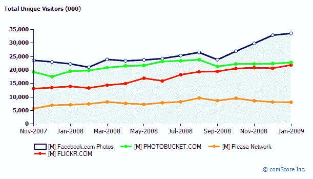
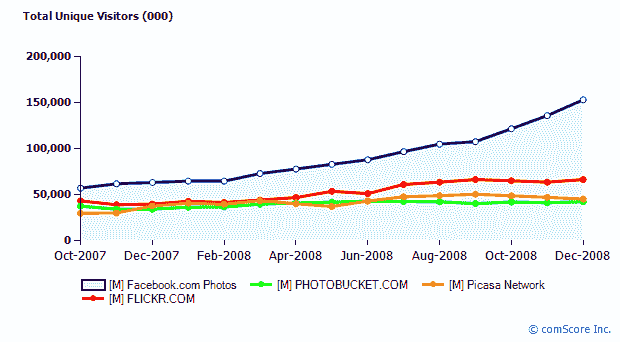

# 脸书照片脱离人群

> 原文：<https://web.archive.org/web/https://techcrunch.com/2009/02/22/facebook-photos-pulls-away-from-the-pack/>

如果脸书有一个突出的应用程序，它必须是照片。就其本身而言，它是网络上最大的照片网站。根据 comScore 的数据，全球范围内脸书每月有 69%的访客会查看或上传照片。超过 100 亿张 T2 的照片被上传到网站上。

它一直在与竞争对手拉开距离。从上面的 comScore 图表中可以看出，就在去年 9 月，美国前三大照片网站还在并驾齐驱，脸书照片网站的独立访问者为 2390 万，其次是 Photobucket 网站的独立访问者为 2130 万，Flickr 网站的独立访问者为 1950 万。但到 1 月份，每月前往脸书拍照的美国游客数量飙升 41%，达到 3360 万。与此同时，Photobucket 仅增长了 7%，达到 2280 万，而 Flickr 增长了 12%，达到 2190 万。(在美国，Picasa 以 810 万用户远远落后于第四名。

换句话说，脸书将其最接近的竞争对手(美国的 Photobucket)的月度独立访客数从 260 万增加到了 1080 万。在全球范围内，脸书照片和 Flickr(全球第二大网站，在美国似乎即将超过 Photobucket)之间的差距从 9 月份的 4120 万独立月访问量增加到 12 月份的 8700 万(最新数据，见下图)。

脸书在摄影部门的优势是什么？最大的因素仅仅是它是世界上最大的社交网络的默认照片功能。在脸书受益的所有病毒循环中，它的照片应用程序可能内置了最大的病毒循环。每当你的朋友用你的名字在照片上做标记，你就会收到一封电子邮件。这一单一功能将标记和组织照片这一孤立的杂务转变为一种强大的通信形式，以即时、可视化的方式将人们通过他们过去所做的活动联系起来。如果人们从这些照片通知中点击回到脸书的比率高于任何其他通知，包括私人信息，我不会感到惊讶。

但是标签功能已经成为脸书照片的一部分很长时间了。9 月份发生了什么加速增长？就在那时，脸书的重新设计开始生效，T2 在每个人的个人主页上增加了一个照片标签。

(上图显示了 1 月份的美国游客数量。下图显示了截至 12 月的国际访问者，其中脸书照片的独立访问者为 1.533 亿，Flickr 为 6670 万，Picasa 为 4550 万，Photobucket 为 4270 万。

