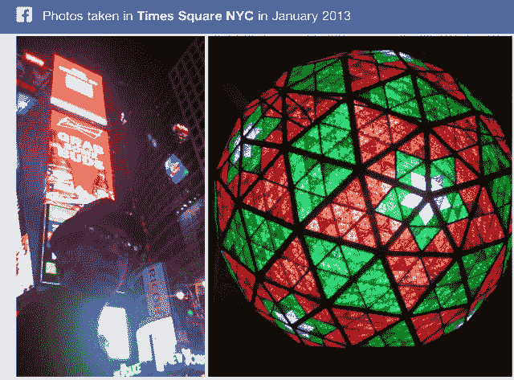

# Facebookers 用户提供图片搜索，并在元旦/除夕上传 11 亿张照片，创下纪录 

> 原文：<https://web.archive.org/web/https://techcrunch.com/2013/01/17/facebook-photos-record/>

# Facebookers 用户提供图片搜索，并在新年前夕上传了 11 亿张照片，创下纪录

还没有人知道这一点，但全世界的人都给了图片搜索一顿丰盛的大餐，他们在新年前夜的 48 小时内上传了创纪录的 11 亿张照片。这几乎是平均每天上传到脸书的 3 亿张照片的两倍。脸书的内容上传统计有了新的含义，因为图片搜索让所有分享的东西都更容易被发现。

11 亿张照片的数据得到了脸书发言人的证实。这个数字超过了去年新年分享的创纪录的 8.44 亿张照片。马克·扎克伯格在周二的[图片搜索发布会](https://web.archive.org/web/20221223160252/https://techcrunch.com/2013/01/15/facebook-announces-its-third-pillar-graph-search/)上宣布，脸书收集了 2400 亿张照片，这十亿张额外的照片增加了他的收藏。所有这些照片现在都在脸书新的内部搜索引擎中被编入索引。

新年照片可以帮助朋友或陌生人，根据他们各自的隐私设置，[决定 2014 年 12 月 31 日](https://web.archive.org/web/20221223160252/https://techcrunch.com/2013/01/15/what-can-i-search-for-on-facebook/)在哪里度过，或者只是给他们一些好看的东西浏览。不幸的是，由于图形搜索仍处于测试阶段，你不能通过关键字或确切日期进行搜索。你现在能做的最好的事情就是搜索“十二月在纽约时代广场拍摄的照片”或者“…一月”

尽管 Instagram 增长迅速，但其母公司脸书仍然看到更多的照片上传，这要归功于其更高的用户数量和批量上传选项。根据 Instagram 今天分享的[新数据，首先由](https://web.archive.org/web/20221223160252/http://instagram.com/press/) [AllThingsD](https://web.archive.org/web/20221223160252/http://allthingsd.com/20130117/after-reports-of-user-revolt-instagram-releases-monthly-active-user-data-for-the-first-time/) 发现，Instagram 平均每天上传 4000 万张照片，大约是脸书正常一天的七分之一，是脸书新年前夕或新年当天的十三分之一。然而，Instagram 在 2012 年火鸡日看到了[1000 万张带有感恩节参考的照片](https://web.archive.org/web/20221223160252/https://techcrunch.com/2012/11/23/instagram-thanksgiving/)。

吸引大量的照片不仅仅是给了脸书一些可以展示给用户的东西。有价值的元数据有待挖掘。照片标签告诉脸书人们和谁一起度过了他们的离线时光，而赞和评论则告诉新闻 feed 谁的内容该给谁看。

图形搜索也使得照片的位置标签对社交网络更加重要。它可以利用你在当地商店拍的照片向你的朋友推荐那个地方。虽然你喜欢的企业可能已经[经年累月变得陈旧，或者已经通过广告被收购](https://web.archive.org/web/20221223160252/http://stevecheney.posterous.com/graph-searchs-false-promise-and-the-con-of-th)，但地理标签照片是一个更干净的数据集。

你可能不会在你讨厌的地方拍很多照片。毕竟，我没有看到很多人从车管所上传照片。