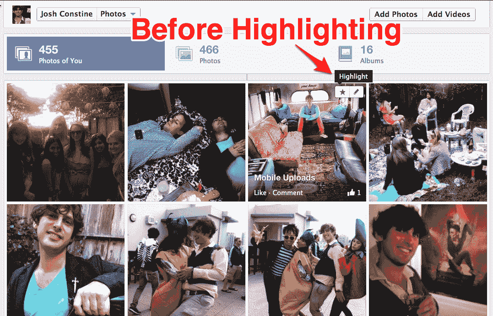
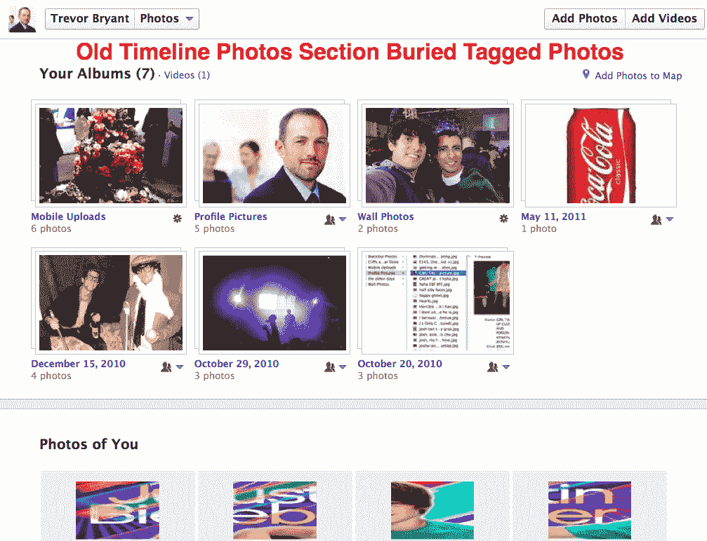
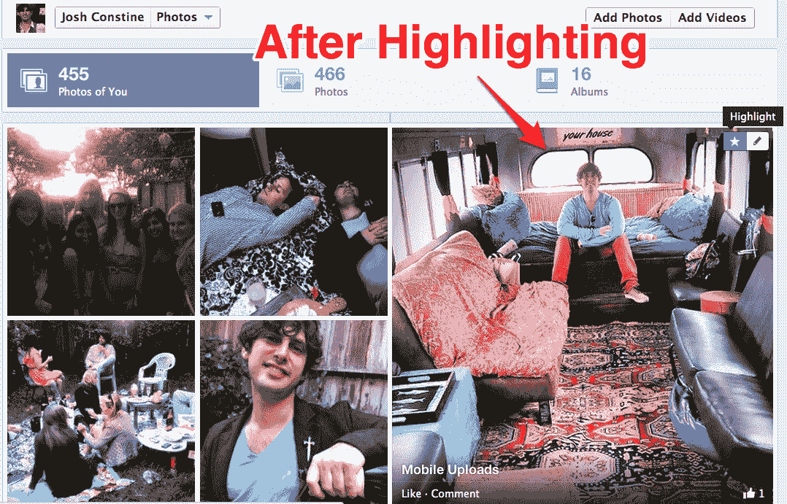

# 脸书时间轴照片重新设计，让您将收藏夹放大 4 倍，首先显示标记的照片 

> 原文：<https://web.archive.org/web/https://techcrunch.com/2012/07/30/facebook-photos-timeline/>

# 脸书时间线照片重新设计，让您放大收藏的 4 倍，首先显示标记的照片

脸书将照片策展提升到了一个新的高度。现在，您可以收藏自己的照片，使它们在您个人资料的修改后的照片部分放大 4 倍。在未来几天推出的重新设计也看到了一个更好的导航系统，首先将你带到“你的照片”或你所在的任何人的个人资料，而不是相册列表。

更新不会像 Google+现在在平板电脑上的[新闻订阅那样，根据喜欢和评论自动显示你时间线上最喜爱的照片。尽管如此，它数字化了我们在现实世界中与照片互动的自然行为——制作我们最喜欢的大照片。](https://web.archive.org/web/20221006185415/https://beta.techcrunch.com/2012/07/10/google-plus-ipad/)

今天的重新设计使脸书个人资料的照片部分更接近以前的布局。自从 Timeline 推出以来，当你点击进入查看照片时，脸书会强迫你在一大堆相册和隐藏在页面底部的带标签的照片之间做出选择。现在，可通过时间线封面下方的“照片”磁贴访问的照片部分被合理地分为三个选项卡:

*   “您的照片”或“[朋友姓名]的照片”——这是默认视图
*   某人单独上传但未标记的“照片”
*   "相册"

考虑到你通常对朋友的标签照片最感兴趣，尤其是当你第一次成为某人的朋友时，重新设计让你首先访问最相关的内容。

为了确保朋友们在你看起来最好的地方或你展示摄影技巧的地方看到照片，你可以将鼠标悬停在照片上，然后单击“高亮”，以非常时髦的小动画形式立即将照片放大到四倍。脸书已经为你的时间线帖子提供了这个功能，但放大状态更新或链接几乎没有用，这个功能更适合专门的照片部分。

没有通过喜欢、评论和点击进行自动管理，而脸书肯定可以做到。事实上，脸书已经在新闻提要中这样做了，当你一次分享几张照片时，放大最吸引人的照片。

让脸书处理突出显示并让我批准其选择的选项可能会对帮助/挤压那些不太热衷于策展的朋友的更多点击有很大帮助。不过现在，你应该快速浏览一下你的旧照片，选出最好的。没必要像你最好的微笑一样给双下巴足够的空间。

想知道脸书下一步要做什么吗？本周五参加我们的[脸书生态系统总结](https://web.archive.org/web/20221006185415/https://beta.techcrunch.com/events/crunchup-august-capital-party-2012/event-info/)，直接从公司领导那里获得独家新闻。