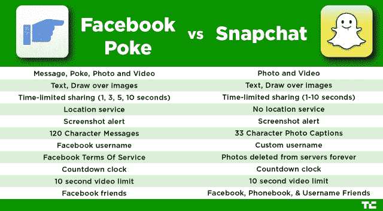
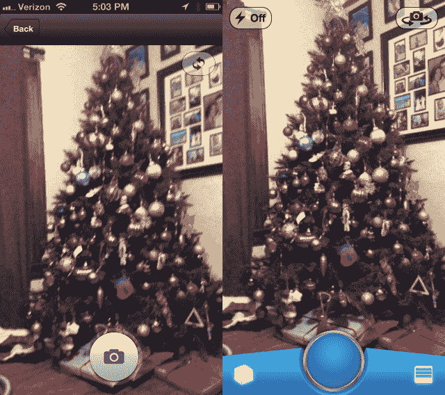
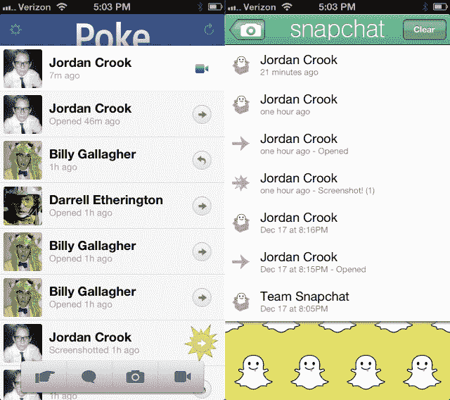

# 脸书·普克和 Snapchat:有什么区别？TechCrunch

> 原文：<https://web.archive.org/web/https://techcrunch.com/2012/12/21/facebook-poke-vs-snapchat-what-is-the-difference/>

今天，脸书推出了一款名为[戳](https://web.archive.org/web/20221006012047/https://beta.techcrunch.com/2012/12/21/facebook-poke-app/)的新手机应用。它与一款风靡博客圈的名为 [Snapchat](https://web.archive.org/web/20221006012047/https://beta.techcrunch.com/2012/10/29/billion-snapchats/) 的新照片分享应用惊人地相似。

Snapchat 和 Poke 都可以让你发送图片或视频，然后在几秒钟内销毁。

但是这个社交网络已经正式推出了它的[竞争对手](https://web.archive.org/web/20221006012047/https://itunes.apple.com/app/id588594730)，差异很少但很重要。

Snapchat 和 Poke 之间最大的区别可能归结于服务条款，这正符合 Instagram 对话仍在燃烧的情况。

目前还不清楚 Poke 是否会在脸书的服务器上保存这些图片。我们已经联系了脸书，正等着看脸书在现在已经空了的支持页面上放些什么。

如果符合脸书的服务条款，脸书很可能会在内容被删除前保留一段时间。当你的内容被破坏时，脸书的 TOS 是这样说的:

> 当您删除 IP 内容时，其删除方式类似于清空计算机上的回收站。但是，您理解删除的内容可能会在备份副本中保留一段合理的时间(但其他人将无法使用)。

社交网络可能需要为这款应用开发一些新的语言，而不是让脸书的所有产品都遵循相同的服务条款。事实上， [Josh Constine](https://web.archive.org/web/20221006012047/https://beta.techcrunch.com/2012/12/21/facebook-poke-app/) 已经了解到，脸书实际上可能会完全删除其服务器上的照片，或者至少让用户和员工完全无法访问这些照片。我们将等待确认。

**更新:**脸书为 Poke 澄清了它的服务条款:

> 所有戳消息都以加密形式存储，并在最后一个收件人查看戳后保留两天，这一过程有助于促进滥用报告。在这段时间之后，Poke 的加密密钥被删除。但是，仍然可以从日志或备份中恢复该密钥。在一段固定的时间之后，该密钥变得不可访问，使得内容完全不可读(除非它被拷贝用于滥用报告。)如今，该固定期限可长达 90 天，但我们正在努力在未来几周内大幅缩短该期限，因为我们将验证戳删除系统的稳定性。

Snapchat 的方法是，一旦接收者看到图片，就从服务器上删除。

第二个重要的区别是 Snapchat 和 Poke 把你和朋友联系起来的方式。

Snapchat 使用脸书来寻找朋友，显然 Poke 也是如此，所以 Poke 在自动集成方面更胜一筹。尽管如此，Snapchat 实际上可能会帮助你找到更多的朋友，因为你可以通过电话号码或用户名搜索来添加朋友。

Snapchat 的用户名定制也值得考虑。这款应用拥有一群使用*选择的*昵称的忠实用户。这可能是 Snapchat 和脸书·普克之间最大的区别之一。

当你在移动设备上下载 Poke 时，你立即用你的脸书个人资料登录，把你降级到你在脸书使用的名字和你在那里的朋友。

虽然我一点也不相信 Snapchat 主要是用来发色情短信的，但我确实认为可能有一些喜欢用 randos 抓拍的用户(Twitter 就是证明)愿意保留他们的匿名用户名。

Poke 还有两种额外的交互形式:纯文本消息和“poke”

两者都可以让你在照片上叠加文本，两者都可以让你在照片上绘制各种颜色(如果我们变得挑剔，Snapchat 有更多的颜色选择)。

在您拍摄照片(或视频)并添加文本和插图后，这两个应用程序都允许您设置收件人可以查看内容的时间限制。在 Poke 上，第二个限制是在 1、3、5 或 10 秒之间选择，而 Snapchat 让你选择 1 到 10 秒之间的任何时间。

实际的功能差异很小，但是看着这个空间起飞会很有趣，因为脸书已经开始行动了。

