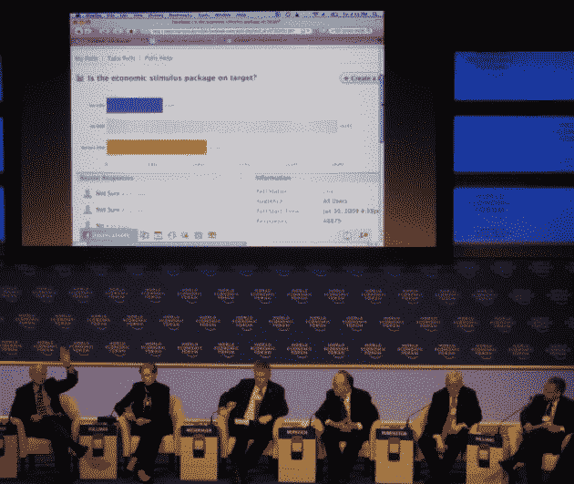
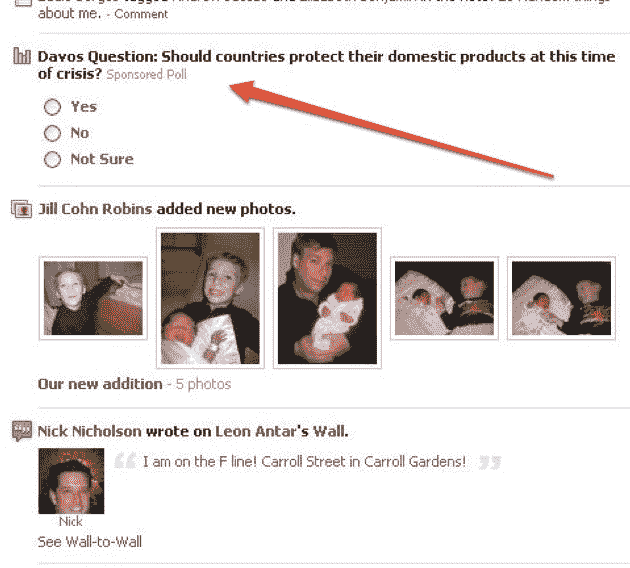

# 脸书民意调查为达沃斯精英带来现实 

> 原文：<https://web.archive.org/web/https://techcrunch.com/2009/02/01/facebook-polls-bring-reality-to-davos-elite/>

# 脸书民意调查让达沃斯精英面对现实

上周在达沃斯举行的世界经济论坛上，YouTube 并不是唯一一家引起轰动的互联网公司[。脸书的](https://web.archive.org/web/20230203020906/http://techcrunch.com/2009/01/31/youtube-and-google-earth-demo-the-talk-of-davos/)[兰迪·扎克伯格](https://web.archive.org/web/20230203020906/http://www.crunchbase.com/person/randi-zuckerberg)正忙着给精英讨论带来一剂现实。

扎克伯格安排脸书民意调查在十二个关键时段进行。在一次名为*给美国总统的竞争力建议*的调查中，脸书的用户被问及刺激计划是否达到目标。20 分钟内记录了 12 万个回复。59%的受访者表示“不会”，15%表示“会”，26%表示不确定。

民意调查结果显示在小组成员的上方，包括鲁珀特·默多克(新闻集团首席执行官)、爱伦·库尔曼(杜邦首席执行官)、邓肯·尼德奥尔(纽约泛欧交易所首席执行官)、大卫·鲁宾斯坦(凯雷集团董事总经理)和罗纳德·威廉姆斯(安泰首席执行官)。在民意调查结果出来之前，小组成员在他们的评论中基本上赞成经济刺激计划。脸书用户显然不同意(下面嵌入了整个会话)。

我昨天采访的世界经济论坛官员对民意调查很满意，显然对他们能给会议带来直接、实时的反馈感到兴奋。

脸书民意调查不能再由用户创建，但脸书继续直接使用该产品。或许他们在达沃斯的经历将说服他们重新开放该产品。

[YouTube http://www.youtube.com/watch?v=k4Df-Dd93XE&hl=en&fs=1]