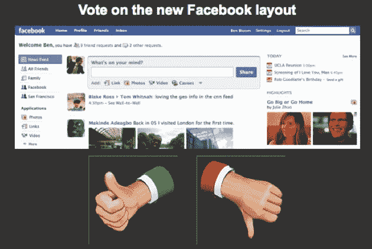
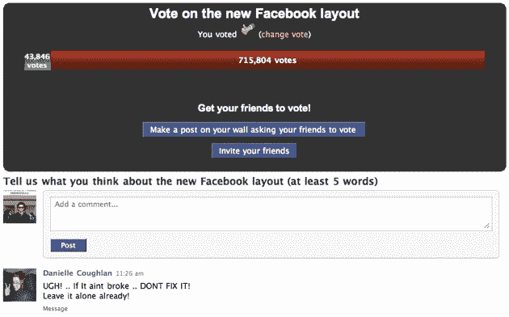

# 脸书民意调查:94%的用户不喜欢重新设计 

> 原文：<https://web.archive.org/web/http://techcrunch.com/2009/03/19/facebook-polls-users-on-redesign-94-hate-it/>

# 脸书民意调查:94%的用户不喜欢重新设计

一个脸书应用程序正在[对](https://web.archive.org/web/20230216073451/http://apps.facebook.com/layoutvote/)[新网站布局](https://web.archive.org/web/20230216073451/https://techcrunch.com/2009/03/11/facebooks-real-time-homepage-goes-live-today/)上的用户进行投票。到目前为止，在近 80 万名受访者中，仅有 5%的人表示赞同。其余的走另一条路。

用户也可以留下自己想法的评论。最近的用户评论包括“*错过了这么多我曾经喜欢的功能。我很难过，“请把它改回原来的样子，”和“我讨厌它，如果它不改变，我只会偶尔检查一次。”*啊，善变的用户。直到一月份，用户和广告商可以直接在脸书创建民意调查，该公司在达沃斯世界经济论坛上广泛使用这些调查。如果他们能直接恢复这个功能，那就太好了。