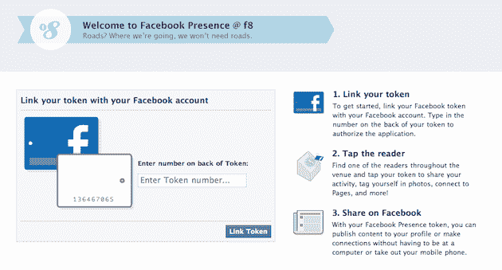

# 脸书存在:通过 RFID 定位在 F8 

> 原文：<https://web.archive.org/web/https://techcrunch.com/2010/04/21/facebook-presence/>

# 脸书存在:通过 RFID 定位在 f8

今天在脸书的 f8 会议上，该公司给所有与会者发了一个贴在会议徽章上的小 RFID 标签。这个标签是一个叫做“脸书存在”的东西的一部分，它允许你通过刷你的徽章在会议的各个地方“签到”。是的，它的位置。

这实际上是脸书在总部为其臭名昭著的小桶机器人使用的同一东西。员工们已经使用这个很长时间了，现在他们让我们其他人也享受这个乐趣。要使用它，你去[这个页面](https://web.archive.org/web/20230203220156/http://www.facebook.com/presence/)，手动输入你的标签号码，链接到你的脸书账户。然后，每次你在某个地方刷你的徽章，它会直接进入你的个人资料。显然，你也可以用这种方式在照片中标记自己。

虽然我们已经知道脸书[将使用二维码](https://web.archive.org/web/20230203220156/https://techcrunch.com/2010/03/19/facebook-qr-codes-location/)作为其定位策略的一部分，但还不清楚脸书是否真的计划在更大范围内使用二维码。当然，需要随身携带标签是进入的一个障碍——就像获得安装这些阅读器的场所一样。希望我们能在今天的会议上听到更多关于这方面的信息。

