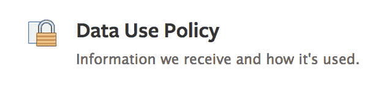

# 脸书充实隐私政策以符合数据保护审计，将于周一举行问答 TechCrunch

> 原文：<https://web.archive.org/web/https://techcrunch.com/2012/05/11/facebook-privacy-policy-changes/>

今天，脸书将开始向用户发送 30 亿份通知中的第一份，通知内容是关于对其隐私政策的拟议修改，这些修改是为了遵守春季实施爱尔兰数据保护专员的审计建议的最后期限。今天早上我们谈话时，[脸书首席隐私政策官 Erin Egan](https://web.archive.org/web/20221207114021/https://beta.techcrunch.com/2011/11/29/in-response-to-ftc-privacy-settlement-facebook-splits-the-cpo-role-into-two/) 告诉我的三个最大的变化是对现有但有时模糊的政策的几个澄清:

*   关于当你在 Facebook.com 以外的其他网站上时，脸书可能会使用你的数据为你提供广告的现有政策的澄清
*   一份详细的新图表显示了脸书如何使用 cookies 来改进脸书，但却无法在网上跟踪你
*   更详细地解释在某些情况下，脸书将如何“根据需要保留[您的]数据以向您提供服务”，无论是更少还是更多时间

脸书的目标是让用户尽可能容易地理解他们的数据是如何被使用的，以及这是如何改变的。因此，脸书还推出了[“脸书条款和政策中心”](https://web.archive.org/web/20221207114021/http://www.facebook.com/policies)来存放它的 10 份政策文件，包括今天的隐私政策(被称为数据使用政策)的[修订版](https://web.archive.org/web/20221207114021/https://developers.facebook.com/attachment/Data%20Use%20Policy%20REDLINE.pdf/)，以及对这些修订的[解释](https://web.archive.org/web/20221207114021/https://developers.facebook.com/attachment/DUP_User_Final.pdf/)。脸书将于 5 月 14 日举行一场关于这些变化的直播问答。从现在起，用户将有七天的时间对这些改变给出反馈，除非有重大异议。

现在，这些变化已经可供审查，脸书将开始向其网络和移动界面发送提醒，以检查这些变化。它预计将为这些通知提供 30 亿次展示，CPO Egan 告诉我，它希望向所有 9 亿多用户显示三次警报。

脸书重新设计了[数据使用政策](https://web.archive.org/web/20221207114021/http://www.facebook.com/about/privacy/)本身，加入了用灯泡标记的额外提示、帮助中心的新链接，以及政策如何影响你在网站上采取行动的例子。该政策的许多部分都有小的更新，以解释时间线和活动日志等新功能的工作原理。

从商业角度来看，最有趣的变化是澄清了脸书可以在你离开网站时向你展示标准广告，而不仅仅是政策已经声明的社交广告。这很有趣，因为除了在 Zynga 的独立网站上帮助运行广告之外，脸书目前没有显示任何非现场广告。许多人猜测，脸书最终将推出一个场外广告网络，可以嵌入任何其他网站，向访问该网站的脸书登录用户显示以脸书数据为目标的广告。脸书从未公开承认这一计划，但今天的数据使用政策的变化给了它更多的自由来推出一个场外广告网络。

总的来说，这些变化应该会让用户在浏览脸书时感觉更舒服，因为如果他们有任何问题或者对他们的数据如何被使用感到困惑，他们将有一个单一的地方找到答案。通过遵守审计建议，脸书表明它愿意与政府机构合作，以保护其超过 9 亿人的用户群。详细的文档和脸书条款和政策中心应该激励其他公司提供更容易的数据使用和隐私信息。

由于脸书现在只提供下载文档，我在下面嵌入了红线变更、解释和 cookies 文档，后面是我对最重要变更的注释。您可以在 2012 年 5 月 18 日下午 5:00 之前[在此](https://web.archive.org/web/20221207114021/http://www.facebook.com/fbsitegovernance/app_4949752878#!/note.php?note_id=10151726588550301)提交您对提案的反馈

标注了今天对数据使用政策
的提议变更的红色版本[scribd id = 93240896 key = key-1 xqa 43 pr 1 uidwyegft 7 mode = list]

对今天提出的数据使用政策变更的解释
[scribd id = 93240907 key = key-277 thbmpmc 5 dnfp 6 gxad mode = list]

《Cookies 的工作原理》信息表
[scribd id = 93241445 key = key-1 dxhj 0 o 1 p 6 zskgmc 5 app mode = list]

大多数划红线的变化实际上只是对现有政策的澄清，但我认为以下这些变化尤其重要。为了便于参考，我在标记的隐私文档中用格式 4.3 标注了它们的位置，以表示更改在第四页的三分之一处:

1.3–您上传的联系信息受数据使用政策保护

2.1–脸书可能会保留您最后一篇位置标签帖子的 GPS 坐标，以便向您发送相关通知

3.5–您的数据可能用于“内部运营，包括故障排除、数据分析、测试、研究和服务改进”

3.8–只要“有必要向您和其他人提供产品和服务”，您的一些数据就会被存储，通常“直到您的帐户被删除”

3.9–脸书可以根据您的数据提出照片标签建议

4.2–当您被停用时，朋友仍会在您的朋友列表中看到自己

4.5–有些数据没有存储在您的帐户中，如您发送的群帖子或消息，因此即使您删除了帐户，这些数据也不会被删除

4.9–如果你对公开的事情发表评论，你的评论将是公开的

5.1–人们可以更改您评论的帖子的隐私设置，这可能会向公众透露之前的私人评论

5.3–人们可以通过您的联系信息找到您，即使您没有与他们共享该联系信息。不过，你可以控制这个

6.1–其他用户可以将您的内容和联系信息保存并同步到他们的设备，然后这些信息可能会通过未经授权的第三方应用程序被访问，因此在与朋友共享联系信息之前，请理解这一点

6.3–关于活动日志的附加内容，包括您隐藏的内容不会被删除

6.5–关于在帖子中添加标签的人如何始终可以看到这些帖子的详细信息。

7.3 页面管理员可以利用洞察力来发现你是否喜欢或访问过他们的页面

7.8–您访问的应用程序会接收您的年龄信息，以便为您提供适合年龄的内容

8.9-当你登录其他网站时，脸书总是对你的电子邮件进行哈希处理，你的电子邮件被传送到脸书以识别你的身份，但现在它使用术语“哈希”而不是“加密”

9.3-如果你从一个社交插件分享，并看到该帖子的隐私设置指标，假设该帖子被公开分享

10.5–你在脸书上做的和分享的所有事情都可能被用来向你投放广告

11.5-游戏开发商和其他公司希望将广告投放到特定的用户群体中，例如他们得分最高的玩家，可以向脸书提供这些用户的电子邮件地址或用户 id，以便脸书可以将广告商的广告指向他们。脸书已经有了你注册时的数据，但当广告活动不再需要时，它会删除广告商传递给它的这些实例

12.2–一个新的大部分阐明了 cookie 的使用，包括它们帮助脸书改进了什么，并且您可以阻止或删除它们，但可能会对您的脸书服务造成损害

12.9–脸书在美国商务部安全港网站上列出了其欧盟安全港认证

13.1–脸书现在列出了一个地址，如果您对加州隐私法有任何问题、疑虑或咨询，可以通过邮件联系该地址(14.8)。对于美国和加拿大居民:1601 柳树路，门洛帕克，CA 94025。对于其他人，脸书爱尔兰有限公司，汉诺威码头，5-7 汉诺威码头，都柏林 2 爱尔兰，或者你可以[使用这种联系方式](https://web.archive.org/web/20221207114021/https://www.facebook.com/help/contact_us.php?id=173545232710000)

13.3–如果法律要求或义务、政府调查或“违反脸书政策”的调查，脸书可能会长期保留您的数据

14.3–脸书不保证它能保护您免受垃圾邮件的侵害