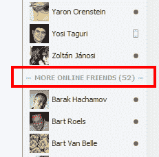
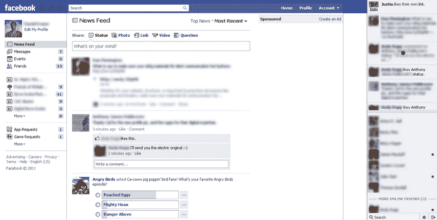
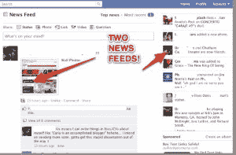

# 脸书推出聊天和其他实验的变化，引发问题 TechCrunch

> 原文：<https://web.archive.org/web/https://techcrunch.com/2011/08/11/facebook-rolls-out-changes-to-chat-other-experiments-leads-to-problems/>

几个用户报告说，脸书对脸书聊天侧边栏功能进行了修改。现在，您最喜爱的在线朋友出现在聊天的顶部，下面有一个名为“更多在线朋友”的单独列表。这让你更容易找到经常聊天的脸书朋友。

然而，我们也看到了一些报道，在这些报道中，精选用户在他们的聊天侧边栏中获得了一个迷你新闻提要。在某些情况下，新闻提要会出现在您的联系人上方。这看起来更像是一次试验性的展示。

以前，脸书聊天工具条把你的朋友作为一个大列表呈现给你，按照名字的字母顺序排列，而不是按照和你的相关性。值得一提的是，这是我在脸书个人资料中仍然保留的聊天侧边栏，这表明正如我们所说，更新仍在部署过程中。

收到新聊天更新的人会看到聊天边栏分成两部分，顶部是包含您最近聊天的朋友的部分，然后是一个部分，下面是“更多在线朋友”部分，显示您的其他在线联系人。

但这还不是全部！

虽然关于这个的提示很少，但似乎有些用户看到了一个更具实验性的侧边栏，在顶部有一个迷你新闻提要。此新闻源显示您朋友的最新动态和您关注的脸书页面。

这使得您似乎有两个*和*新闻提要，这可能会觉得有点奇怪。

其他人报告看到固定的脸书标题(顶部的蓝色条，滚动时不会移动)。

http://twitter.com/#!/al vito/status/101641409198702592

**引发问题？**

看起来，这些更奇怪的更新中的大多数可能是“桶”测试的结果，即脸书向其用户的子集推出新功能，然后决定是否或何时将这些功能推广到其他安装基础。

这些更新也可能是今天早上几个人似乎在网站上遇到的问题的原因，到目前为止，这些问题包括无法登录，使用脸书连接有问题，“喜欢”东西有问题，无法在朋友的墙上留言以及无法发布状态更新。

http://twitter.com/#!/leiran/status/101646968568295427

http://twitter.com/#!/gamy lander 87/status/101644697772105728

http://twitter.com/#!/cherrrrryBOMB/status/101645751398047745

http://twitter.com/#!/spears marketing/status/101642695411380225

http://twitter.com/#!/jshallow 01/status/101654322340823041

我们已经联系了脸书公关公司，请其发表评论，如果有回音，我们会及时更新。

***更新，脸书的回应:***

几周前我们改变了脸书聊天的工作方式后，我们收到了很多反馈，人们无法看到他们所有的在线朋友。今天早些时候，我们进行了一项更改，以重新启用该功能；脸书聊天现在向您显示与您互动最多的朋友以及您当前在线的其他朋友。

*你所指的“迷你新闻订阅”是我们正在进行的新闻订阅测试(已经进行了一段时间)，与我们昨天所做的更改无关。*

***更新 2** :脸书想让我们知道今天早上缓慢的问题与聊天变化无关，网站现在工作正常。*