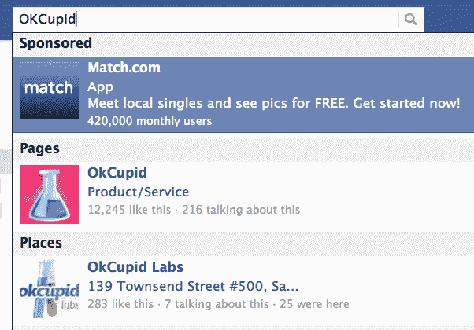

# 脸书正式推出“赞助结果”搜索广告

> 原文：<https://web.archive.org/web/https://techcrunch.com/2012/08/22/facebook-search-ads/>

虽然尚未公开宣布，但脸书现在告诉营销人员，上个月开始测试的[赞助结果搜索 typeahead 广告单元](https://web.archive.org/web/20230404151815/https://techcrunch.com/2012/07/19/facebook-sponsored-results/)“今天推出”。它让营销人员能够锁定搜索特定应用、页面和位置的用户，并在 typeahead 结果中插入一个链接，指向他们自己的应用、页面、自定义页面标签或帖子。企业还不能用广告引导用户离开网站，尽管它们可以出现在排名靠前的有机结果之上，使它们能够有力地从竞争对手那里分流流量。

目前 Zynga(如上图所示)和 Match.com 正在运行赞助结果。广告部门可以让脸书开始挑战谷歌的搜索广告收入。

[ **更新**:脸书现在告诉我“我们最近开始更广泛地推出赞助结果。”**更新 2** :脸书证实了这篇文章，在太平洋标准时间下午 6 点通过其[开发者博客](https://web.archive.org/web/20230404151815/http://developers.facebook.com/blog/post/2012/08/22/platform-updates--operation-developer-love/)宣布“我们发布赞助结果是一种让你的应用、页面或位置获得更多关注的好方法”，但后来改变了帖子，删除了“发布部分”，只注明“我们正在为开发者提供一个 API 来赞助搜索结果。”]

自从他们第一次开始测试以来，脸书已经对赞助结果设计做了一些修改。它们现在出现在 typeahead 结果中单独的黑色边框部分。这使得他们付费营销的事实比之前出现在广告底部的灰色小字“赞助商”更加清晰。

用户还可以选择“隐藏广告”,点击角落里的一个小“x ”,就会弹出一个问题，有人隐藏它是因为它“无趣、误导、冒犯、重复”还是其他选项。

与此同时，广告商将很快能够通过脸书的原生广告 API 工具 Power Editor 购买赞助结果，赞助结果出现在用于构建第三方购买工具的[广告 API 文档](https://web.archive.org/web/20230404151815/https://developers.facebook.com/docs/reference/ads-api/sponsored-results/)中。

#### 你的流量就是我的流量

脸书在广告投放方面越来越积极。赞助结果可以出现在用户明显寻找的自然结果之上。例如，搜索年轻约会服务“OkCupid”会返回 Match.com 应用程序的赞助结果，高于 OKCupid 页面和办公地点的有机结果。对于游戏和应用程序来说，这可能是一种强有力的方式，可以通过吸引类似受众的产品来重定向竞争对手的流量。

不幸的是，与显示在谷歌搜索上的结果相比，脸书赞助的结果对广告商的帮助可能仍然要小得多。这是因为当人们在脸书上搜索一个实体时，他们通常会寻找一些非常具体的东西，比如一个特定的游戏或商业，并且更有可能绕过广告。

人们通常不会在脸书搜索“相机”，当然也不会搜索“在哪里买相机？”与此同时，在谷歌上，这些是希望购买新设备的新晋摄影师的常见问题。这意味着，可以说服他们选择某个相机品牌的广告可以为谷歌带来高价，为企业带来丰厚的投资回报。谷歌还发现每月有超过 1000 亿次搜索查询。

虽然这些将“帮助”人们发现新的应用和内容，但我不认为赞助结果对用户体验有很大的改善。话又说回来，它们仅限于搜索类型，所以我认为它们比面向应用开发者和页面所有者的新的非社交新闻提要广告要友好得多，也更符合脸书的商业理念。这可能会稀释饲料的质量，而质量是脸书对用户价值的核心。

这个世界已经非常习惯于搜索广告，人们不会花太多时间在脸书的搜索栏里。因此，如果赞助结果能够让一些目光短浅的批评者闭嘴，这些批评者认为扎克伯格没有实现股东价值最大化，因为他在为长期发展做准备，那么我会支持广告部门。

以下是脸书今天发给一些营销人员的公告，其中一条也传给了我:

> *“赞助结果今天发布，我们想与您分享该产品的详细信息。每天，脸书上的许多人使用我们的搜索来查找人、地点和事物。我们希望帮助他们更好地找到和发现与他们相关的品牌、产品和体验。赞助结果让品牌能够在搜索结果中购买广告，为你的应用、页面或位置带来更多的认知和流量。赞助结果给你:*
> 
> *1。扩大您的信息的传播范围，将其放置在脸书上最常用的功能之一。*
> 
> *2。通过出现在相关的应用程序、页面和位置旁边，能够锁定人们正在寻找的内容。*
> 
> *3。灵活定制您的登陆目的地，如您页面上的特定选项卡。*
> 
> *品牌不能使用此产品开车到异地，但您将能够开车到特定的页面、标签和画布应用程序。*
> 
> *赞助结果将于今天晚些时候在 Power Editor 中发布。”*