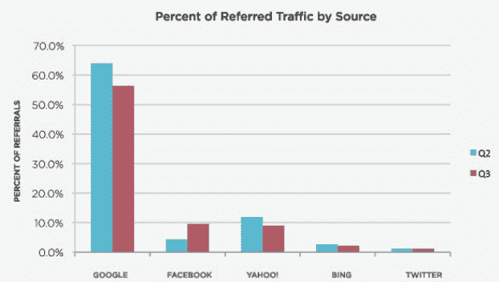
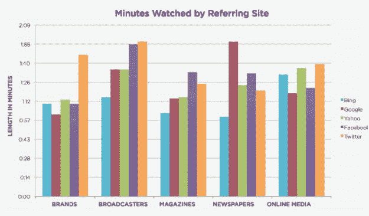

# 脸书超越雅虎成为媒体网站视频的第二大流量来源 

> 原文：<https://web.archive.org/web/http://techcrunch.com/2010/12/23/facebook-second-largest-source-videos/>

# 脸书超越雅虎成为媒体网站视频的第二大流量来源

当谈到让人们观看媒体网站的在线视频时，谷歌仍然是外部流量的最大来源。搜索驱动观点。但是第二大流量来源不是雅虎，必应，或者其他搜索引擎。现在是脸书。根据 Tubemogul 和 Brightcove 联合发布的关于 *[在线视频&媒体行业](https://web.archive.org/web/20230204065339/http://www.tubemogul.com/marketing/whitepaper-online-video-and-media-industry-q3-2010.pdf)* 的报告，脸书在第三季度超过雅虎成为媒体网站在线视频的第二大流量来源。(这项研究测量了 Brightcove 网络上的视频，重点是报纸、杂志、广播公司、品牌和在线媒体网站)。

在第三季度，脸书的份额占在线视频流量的 9.6%。谷歌仍然高于脸书，超过 50%的引用流量来自搜索，但这比第二季度的 60%有所下降。事实上，在所有搜索引擎(谷歌、雅虎和必应)中，媒体网站上视频的推荐流量都在下降。

然而，就实际参与度而言，来自 Twitter 的观众平均观看时间要比来自脸书或搜索引擎的观众长。Tubemogul 已经[追踪 Twitter 更高的参与度有一段时间了](https://web.archive.org/web/20230204065339/https://techcrunch.com/2010/05/05/online-video-winning-media-twitter/)。但是当你分析不同类型媒体网站的参与度时，你会发现更多的是一个大杂烩。Twitter 分享导致广播公司、品牌和在线媒体的视频观看时间更长(下图中的橙色条)，但来自脸书的人在杂志和报纸网站上观看的时间更长(紫色条)。而谷歌(maroon bars)在报纸网站上观看视频的时间仍然超过了这两家公司。如果你想想，这是有道理的，因为人们去谷歌寻找及时的信息，所以他们更有可能在搜索后长时间观看新闻视频，而不是娱乐视频。在所有这些情况下，我们谈论的是平均花费在观看上的时间不到 2 分钟，所以这都是相对的。

这份报告还有其他各种各样的好数据，显示了不同类型的媒体网站在在线视频方面的表现。整个报告是嵌入式的打击。

