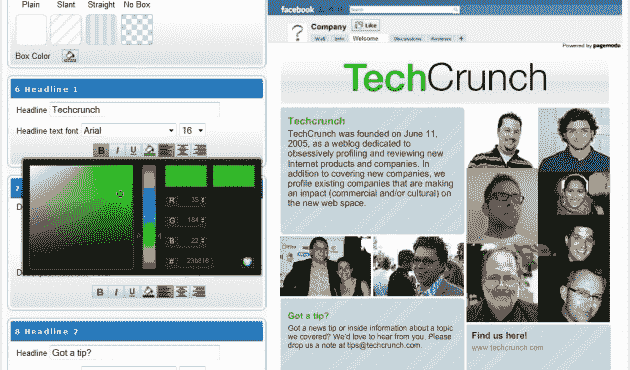

# 最后，一个面向所有人的体面的脸书欢迎标签创建器 

> 原文：<https://web.archive.org/web/http://techcrunch.com/2010/07/04/facebook-tab-creator-pagemodo/>

自从[我的上一篇文章](https://web.archive.org/web/20230204203057/https://techcrunch.com/2010/06/27/facebook-musicians-page/)发布后仅仅两天，就有消息传到我这里，有人即将发布一款新产品(我希望有人会创造的同一款产品)，这将使个人和/或品牌在[脸书](https://web.archive.org/web/20230204203057/http://www.crunchbase.com/company/facebook)的屋顶下生活得更轻松。

我已经能听到你在想，伙计，又是脸书·佩奇？是的。又来了。但是我们不断地谈论它们是有原因的。除了显而易见的一点，这些工具实际上可以帮助你创建一个没有麻烦的页面，并在平台上轻松地推销自己，还有一些新趋势的迹象需要我们注意。

今天，脸书网页看起来大部分是一样的。这可能是因为人们没有时间投资，也没有资格创建一个沉浸式页面，或者他们根本不在乎。但如果你拥有一个品牌，你应该关心。自己制作一个页面并不难，但是需要熟悉一些基本的 HTML，很多人不想被这些所困扰。

虽然脸书似乎只关心对他们有益的东西，但他们并不真正关心成员的易用性。然而，这项服务的使用日复一日地增长，而他们的功能列表仍然保持不变。在这里和那里，你可以看到一些设计上的微调，一些小的东西被添加进来，但总的来说，当谈到在脸书营销你的品牌时，你不能做太多。

如果你是小企业就不会。

我相信，每当脸书感到有变成下一个 MySpace 的风险时，他们就会建立这样的界限，但在这之前还有很长的路要走(如果曾经有过的话)，而且说实话，MySpace 一点也不差(回到过去)。

直到现在，回想起来，我们才意识到我们有一些看起来更好的东西，并且适合这个时代的脸书。但是，它受到“标签”的限制我不明白为什么脸书不允许我们按照自己的意愿定制至少一个标签？

与此同时，越来越多的服务试图给我们定制脸书页面的能力，我们应该感到惊讶吗？这些服务是出于需要而产生的。它始于标签应用，如: [Twittertab](https://web.archive.org/web/20230204203057/http://www.facebook.com/twittertab) 、 [Flickrtab](https://web.archive.org/web/20230204203057/http://www.facebook.com/flickrtab#%21/flickrtab?v=app_243273386320) 、 [YouTubetab](https://web.archive.org/web/20230204203057/http://www.facebook.com/youtubetab#%21/youtubetab?v=app_244494104622) 、 [Picasatab](https://web.archive.org/web/20230204203057/http://www.facebook.com/picasatab) 等等。但你很难找到一种服务能让你如此自由地创建一个“欢迎标签”。但不要担心，我相信我们即将进入一个新的脸书页面创作者趋势，我们很快就会看到更多像 RootMusic 这样的服务，这只是时间问题。

但首先让我向你介绍一项新的服务，它允许你创建一个“欢迎”或“关于”标签，而不需要任何静态的 FBML 知识或太多的工作。进入基于泰国的 Pagemodo ，它允许任何人通过一个制作精美、使用简单的生成器创建一个欢迎页面。

 
(点击查看大图)

这次我真的不需要解释如何创建页面，因为它真的相当简单。使用您的脸书帐户登录后，您将能够创建一个新页面，在该页面中，您将进入一个自我解释的编辑器，帮助您实现您的页面选项卡。您可以在两种布局之间进行选择，并开始创建您的页面(或选项卡，如果您愿意)。只需输入所有需要的信息。您可以添加图片、更改颜色和字体等。最后，你将被要求选择一个标签——“欢迎”或“关于我们”(更多的标签名称即将出现)，并将其安装在你的脸书页面上。如果你有不止一个页面，你可以为每个页面创建一个标签，然后随时通过你的 Pagemodo 帐户来编辑它们。

根据 Pagemodo 的说法，他们将始终提供免费版本，以便每个人，即使是非常小的组织，都可以创建自定义页面，但这些免费页面当然会包括页脚，并可能会限制一些只有付费用户才能获得的高级功能，如添加谷歌分析、自定义标签名称、限量版布局(以便他们可以获得独特的布局)等。目前，Pagemodo 正在开发一个简单的支付解决方案，因此人们至少可以开始删除页脚，并获得“早鸟”折扣。

我在之前的帖子中已经解释了这类页面的价值，但我将很快再次解释:当你设置一个“欢迎”标签作为新访客登陆的第一件事时，你可以在这个标签下放置任何你想要的东西，并更好地解释你的品牌。所有这些页面的主要特点是公司可以定制这些页面，因此它们可以匹配公司的颜色，显示公司的标志等。有了 Pagemodo 提供的服务，他们就可以。

这是你吸引新访客的机会，就这么简单。你可以选择让它保持旧的和无聊的方式，或者花几分钟为你的公司创建一个新的页面。剩下的就看你的了。此外，这项服务是免费的，所以我看不出有什么理由不测试/使用它。总的来说，我相信这是一个双赢的提议。

就像我之前说过的，我相信这只是这种平台的开始，只要脸书不为用户提供定制他们自己页面的工具，我们就会看到更多这样的工具像蘑菇一样冒出来。

如果你已经掌握了一些设计和编码技能，我的第一个指南可能对你更有意义。但是如果你没有，我鼓励你尝试这项服务，分享你的见解和反馈，帮助他们建立一个更好的平台。

或者可以给其他像[讨人喜欢的](https://web.archive.org/web/20230204203057/http://www.likeable.com/)、[卷入者](https://web.archive.org/web/20230204203057/http://www.involver.com/)，或者[维特鲁伊](https://web.archive.org/web/20230204203057/http://vitrue.com/)试试。只知道他们一点都不像 Pagemodo ( [见例](https://web.archive.org/web/20230204203057/http://www.facebook.com/go2web20?v=app_112078882147346))。在大多数情况下，你需要给他们发送图片，然后他们会让他们自己的设计师创建一个页面。当然，你需要付钱。

毫无疑问，我赞成为好产品付费，但我更喜欢完全控制我正在使用的产品。你也应该如此。

[维梅奥·http://vimeo.com/11324783 w = 630 & h = 480]