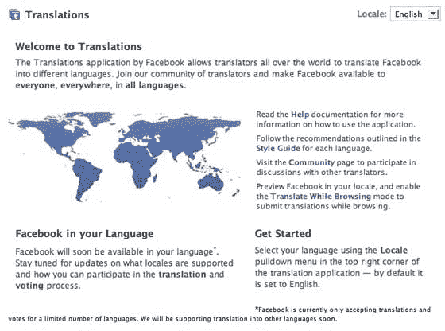

# 脸书让用户创建网站的翻译版本。西班牙语、法语和德语现已推出

> 原文：<https://web.archive.org/web/https://techcrunch.com/2008/01/21/facebook-taps-users-to-create-translated-versions-of-site/>

# 脸书让用户创建网站的翻译版本。西班牙语、法语和德语现已推出

MySpace 继续推出其社交网络的本地版本。[正如我上周在](https://web.archive.org/web/20230226014812/https://techcrunch.com/2008/01/18/myspace-russia-quietly-launches-myspace-turkey-coming/)所写的，他们倾向于在当地建立一个团队(他们现在正在土耳其招聘)，然后不仅用当地语言建立网站，还推广当地艺术家和其他流行文化。MySpace 现在在伦敦、巴黎、柏林、马德里、米兰、斯德哥尔摩、赫尔辛基、奥斯陆、哥本哈根、悉尼、墨西哥城、圣保罗、布宜诺斯艾利斯、多伦多、东京和北京设有办事处。很快将在孟买、莫斯科和伊斯坦布尔开设办事处。

脸书采取了一种完全不同的方法——让用户为他们做所有艰苦的工作。他们在挑选市场(西班牙语是两周前首先开放的；今天推出了德语和法语)并要求一些用户测试他们的协作翻译工具。一旦工具完善，足够的内容被翻译，脸书将为用户提供快速切换网站语言的能力，根据他们的喜好。

就像[谷歌在图片搜索](https://web.archive.org/web/20230226014812/https://techcrunch.com/2006/09/01/google-image-labeler/)和维基百科一直以来所做的那样，有时让你的用户尽可能多做些工作是有意义的。只要用户附和，大家都开心。

翻译应用可以在[这里](https://web.archive.org/web/20230226014812/http://www.facebook.com/translations/)找到，但是目前只有被邀请的用户可以添加和使用。

一旦用户添加了应用程序并启用了“翻译模式”，他们就会从浏览的页面中获得需要翻译的短语。每个短语都是一个简单的小块。提交后，其他用户对提交内容进行投票和/或提交他们自己的版本。更多详情在[这里](https://web.archive.org/web/20230226014812/http://www.facebook.com/translations/?help)。

超过一半的脸书用户现在不在美国。考虑到他们现在都需要用英语浏览网站，这是一个惊人的统计数字。脸书副总裁马特·科勒(Matt Cohler)今天早上告诉我，今天德国只有 60 万活跃的脸书用户(实际上，他是对《商业周刊》的记者说的，但我偷听了，总的来说让自己很讨厌)。当该网站的德语版推出时，这个数字会急剧增加。