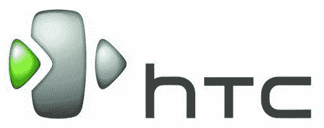
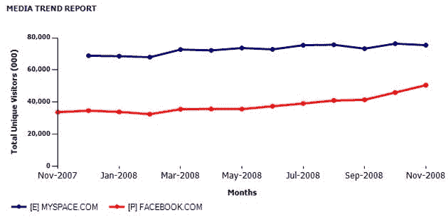

# 脸书考试报名更简单；缩小与美国 MySpace 的差距

> 原文：<https://web.archive.org/web/https://techcrunch.com/2008/12/11/facebook-testing-even-simpler-sign-up-closing-the-gap-with-myspace-in-the-us/>

# 脸书考试报名更简单；缩小与美国 MySpace 的差距

就在几个月前，脸书重新设计了它的主页，并改变了它的标语以简化新用户注册。

现在，他们正在测试一个[甚至更简单的](https://web.archive.org/web/20221206184738/http://corywatilo.com/index.php/2008/12/11/facebooks-new-signup-process-running-on-ab-test/)界面——不再需要询问你的姓名、电子邮件、密码、性别和生日，你只需要管理你的真实姓名。如果转化率上升，预计这将推广到每个人。

脸书也在迅速缩小美国用户与 MySpace 的差距。去年四月，脸书超越了 MySpace，成为全球最大的社交网络。

MySpace 继续在美国占据主导地位，每月有 7500 万访问者(康姆斯克)。一年前，脸书每月只有 3500 万美国访客，而 MySpace 有 6900 万，这意味着 MySpace 的规模大约是美国脸书的两倍。两个月前，脸书的用户数量只有 4000 万，MySpace 的用户数量增加到 7500 万，所以这个比例仍然徘徊在 50%左右(准确地说是 53%)。

但在过去的两个月里，脸书每月新增近 1000 万美国用户，11 月份的美国访客数量激增至 5000 万。MySpace 保持稳定，但是脸书现在是美国 MySpace 的三分之二

如果脸书相对于美国 MySpace 的增长速度继续下去，他们将在明年的某个时候超过他们。

