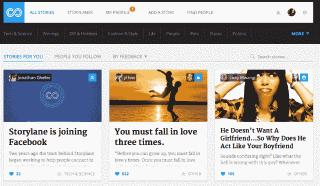

# 脸书与 Storylane 的 Acqhire 加强合作，因为是时候对抗 Tumblr TechCrunch 了

> 原文：<https://web.archive.org/web/https://techcrunch.com/2013/03/08/facebook-tumblr-storylaneduken/>

脸书没有博客平台，但是 Tumblr 有，而且它正在蚕食这个社交网络的年轻用户。如果脸书想要掌控我们的数字生活，它需要更丰富的分享。这是 Storylane 的专长，所以脸书的 ACQ hire 团队听起来像是一个聪明的员工。这家初创公司的首席执行官故事讲述人 Jonathan Gheller 和他的团队可以说服我们分享我们对脸书的快速迷因和长期观点。

你看孩子们，他们喜欢 Tumblr。精通互联网的人也是如此。定制，大图片，动画 gif，如果必要的话可以选择写得更长。这一切让脸书的状态更新框看起来有点局限。时间线可能是你的生活历史，但是大多数人不会把他们的剪贴簿贴满他们的咖啡桌。脸书需要一个更好的家，给那些更关心分享什么和如何分享的人。

等等等等。脸书笔记怎么样？你最后一次看到别人分享笔记是什么时候？这是因为脸书在 18 个月前切换到 Timeline 时埋下了它们，从那以后产品就一直在黑暗中发霉。

[Storylane](https://web.archive.org/web/20221210062759/http://www.storylane.com/) 和 Gheller 可以给脸书的博客意图带来新的生命。 [Storylane 于 2012 年 10 月推出了](https://web.archive.org/web/20221210062759/https://beta.techcrunch.com/2012/10/12/storylane-launch/)，我们自己的安东尼·哈的报道解释说，盖勒希望它成为“个人思想和故事的家园，比快速的脸书或推特更新更深入。”这是记忆、诗歌和个人宣言的好地方。Storylane 甚至会尝试用一些提示来激励你，比如“你在生活中学到的最重要的课程是什么？”或者“你最喜欢什么爱好？”

你知道还有谁开始尝试创造性地([或令人毛骨悚然地](https://web.archive.org/web/20221210062759/https://twitter.com/arrington/status/296082564614090752) ) [提示](https://web.archive.org/web/20221210062759/http://www.insidefacebook.com/2012/06/25/facebook-tests-design-and-wording-changes-to-encourage-users-to-post-more/)你来分享吗？脸书。“你感觉怎么样，乔希？”，“你今天学到了什么？”、“你最喜欢的万圣节记忆是什么？”。难怪盖勒和他的四名员工热衷于与脸书联手，他只是看中了 Storylane 的人才，而不是其产品或数据。

Tumblr 的成功不容易在脸书的围墙花园里实现。Tumblr 上的大多数帖子都是公开的，而且转发博客的工作量很大——这两者都不是脸书的强项。这也是为了分享给那些想订阅你的博客或来找你的人，而不是向你见过的每个人发帖子。脸书和 Storylaners(糟糕的乐队名)需要为脸书的博客帖子找到合适的分发方案。

不过，如果它能成功的话，它将为自己的作品增添一种强大的出版风格。它还能赢回一些它承认正在流失的年轻人。

首先，脸书必须开始渲染 gif 动画。Tumblr 的孩子们(和成年人)永远也看不够。

*【图片鸣谢:[亨德塔克/纽格朗兹](https://web.archive.org/web/20221210062759/http://www.newgrounds.com/art/view/hendertaker/ryu-hadouken)、[哈沃克瑞帕/维基](https://web.archive.org/web/20221210062759/http://streetfighter.wikia.com/wiki/User:HavocReaper48)、[口袋妖怪](https://web.archive.org/web/20221210062759/http://www.pokemon.com/us/)、*