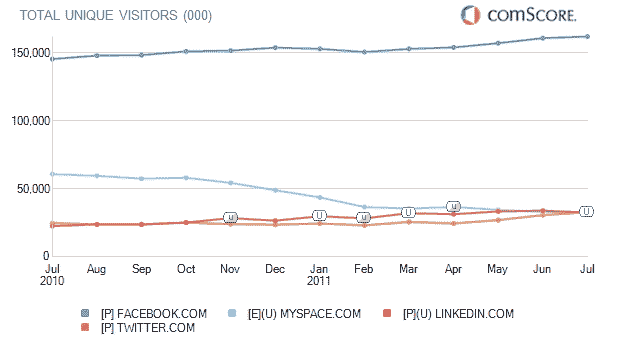

# 脸书，Twitter 在 7 月吸引了创纪录的美国访客数 

> 原文：<https://web.archive.org/web/https://techcrunch.com/2011/08/21/facebook-twitter-saw-record-numbers-of-u-s-visitors-in-july/>

# 脸书，推特在 7 月吸引了创纪录的美国访客

comScore 7 月份的流量数据已经出来，与 6 月份的调查结果相似，脸书和 Twitter 在这个月的美国独立访客流量都创下了纪录。7 月份，脸书的独立访客数量高达 1.62 亿，而 6 月份为 1.608 亿，5 月份为 1.572 亿。

Twitter 在其[的五年历史](https://web.archive.org/web/20230205024128/https://techcrunch.com/2011/03/13/twitters-beginning/)中也发布了创纪录的流量；7 月份有 3280 万独立美国访客，高于 6 月份的 3060 万独立访客和 5 月份的 2700 万独立访客。正如我们过去所指出的，流量的稳步增长对 Twitter 来说是一件大事，Twitter 将流量在自己的移动客户端和用于访问网络的许多第三方客户端之间进行分流。Twitter 刚刚[完成了从旧网络界面到其](https://web.archive.org/web/20230205024128/https://techcrunch.com/2011/08/08/twitter-officially-switches-r-i-p-old-twitter-long-live-newtwitter/)[重新设计、功能丰富的网络应用的转变](https://web.archive.org/web/20230205024128/https://techcrunch.com/2010/09/14/twitter-event/)。

LinkedIn 在 IPO 后流量激增，7 月份美国独立访客数量略有下降，当月独立访客数量为 3，250 万，而 6 月份为 3，390 万。MySpace 的流量继续下降，7 月份的独立访客人数为 3280 万(与 Twitter 持平)，低于 6 月份的 3300 万。

虽然我们曾经认为脸书和 Twitter 会在用户和流量上一决高下，但显然现在情况已经不同了。脸书在美国的流量是 Twitter 访客的五倍。Twitter 没有“杀死”脸书，反之亦然，因为 Twitter 的流量仍在增长。

但是随着新成员 Google+ [稳步赢得用户](https://web.archive.org/web/20230205024128/https://techcrunch.com/2011/07/14/larry-page-on-google-over-10-million-users-1-billion-items-shared/)，看看这个搜索巨头的社交网络是否会达到 Twitter 的流量应该会很有趣。已经有迹象表明谷歌+ [的流量正在放缓](https://web.archive.org/web/20230205024128/https://techcrunch.com/2011/07/27/google-minus/)，但现在还为时过早，这种情况可能会改变。