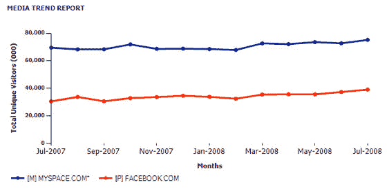

# 美国市场上的脸书诉 MySpace:音乐因素 

> 原文：<https://web.archive.org/web/https://techcrunch.com/2008/08/22/facebook-v-myspace-in-the-us-market-the-music-factor/>

脸书现在是世界上最大的社交网络。但他们仍然落后于 MySpace，在美国有 3600 万用户，按照目前的增长速度，他们需要 18 年才能超过 MySpace。

[脸书的大部分增长](https://web.archive.org/web/20221006074056/http://www.beta.techcrunch.com/2008/08/12/facebook-is-not-only-the-worlds-largest-social-network-it-is-also-the-fastest-growing/)是国际化的，在那里他们执行了一个聪明的策略，通过让用户为他们做[翻译工作](https://web.archive.org/web/20221006074056/http://www.beta.techcrunch.com/2008/03/31/facebook-gets-aggressive-on-translations-adding-22-more-languages/)来快速推出网站的本地化版本(相比之下，MySpace 通过[命令和控制基础设施](https://web.archive.org/web/20221006074056/http://www.beta.techcrunch.com/2008/01/18/myspace-russia-quietly-launches-myspace-turkey-coming/)来扩展，将人们放在每个新的国际市场的地面上)。但是这些国际用户的商业价值远远低于美国、英国、日本和其他几个拥有强大在线广告市场的国家。

**音乐是否延续了 MySpace 在美国的领先地位？**

音乐是 MySpace 的领地。他们拥有数以百万计的艺术家和乐队页面，任何新乐队首先要做的事情之一就是创建他们的 MySpace 页面。MySpace 表示，每月有 3500 万人访问他们的音乐网站，包括 MySpace Music 和各种艺术家页面。一些艺术家有数百万的“朋友”,这些页面允许播放流媒体音乐，艺术家可以控制网站的外观和感觉，等等。

相比之下，脸书没有真正的内部音乐战略。艺术家可以建立页面来推广自己，但这些页面与任何其他粉丝页面没有什么不同(例如，没有流媒体音乐)——网站上没有任何音乐或艺术家的特定内容。

[下个月](https://web.archive.org/web/20221006074056/http://www.beta.techcrunch.com/2008/07/23/myspaces-dewolfe-says-new-music-joint-venture-to-launch-in-september/) MySpace 将推出一家新的音乐合资公司，主要唱片公司称[将拥有](https://web.archive.org/web/20221006074056/http://www.beta.techcrunch.com/2008/07/25/amazon-to-power-upcoming-myspace-music-downloads/)音乐流、播放列表、下载、商品销售、铃声和其他功能。它不仅可能成为音乐的主要目的地，也可能成为 MySpace 和唱片公司的重要收入来源(也可能会给艺人带来一点收入)。

音乐是推动 MySpace 历史增长的重要因素，我相信这也是他们在美国市场保持领先脸书的主要因素。

脸书对 MySpace 音乐的回应:iLike

脸书似乎根本没有参与任何直接的音乐战略。相反，他们把赌注压在了没有流媒体协议的第三方应用程序 [iLike](https://web.archive.org/web/20221006074056/http://www.ilike.com/) (他们[搭载了 Rhapsody](https://web.archive.org/web/20221006074056/http://www.beta.techcrunch.com/2008/07/20/ilike-launches-full-song-playback-and-ad-platform/) )。上个月，脸书宣布，他们将通过他们新的[伟大的应用程序计划](https://web.archive.org/web/20221006074056/http://www.beta.techcrunch.com/2008/07/23/liveblogging-the-facebook-developer-conference/)给予 iLike 访问脸书的特别权限。我们听到的所有官方和非官方消息是，从长远来看，iLike 是脸书的音乐合作伙伴。

我们是 iLike 的超级粉丝。但音乐是一个如此大的类别，完全被 MySpace 所主导，似乎他们应该直接控制他们的整体音乐战略。今天，脸书的用户想要流媒体音乐必须通过一个合同迷宫，从标签到 Rhapsody 到 iLike 到脸书。与此同时，我无法访问 MySpace 页面而不被流媒体音乐攻击。

脸书的核心仍然是一个普通的社交网络，通过社交图，提供了一种与朋友联系的简单方式。相比之下，MySpace 不仅拥有社交网络，还在音乐领域拥有巨大的影响力。这不仅提供了一个去网站的理由，也提供了一个很好的商业模式。