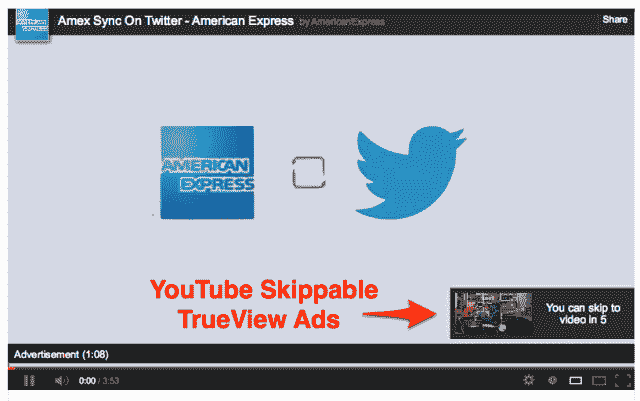

# 副总裁证实，可怕的自动播放视频广告可能会进入脸书 

> 原文：<https://web.archive.org/web/https://techcrunch.com/2013/02/15/facebook-video-ads/>

自动播放的电视广告可能很快就会登陆脸书的新闻频道。本周，脸书商务副总裁大卫·费舍尔承认自动播放视频广告可能会分散注意力，但他表示“我相信我们有办法做到这一点。”费舍尔在他的斯坦福未来媒体会议主题演讲中说，他欣赏 YouTube 的视频广告。但是自动播放的视频片段在安静的新闻源中可能会很花哨，很烦人。

在周三[与](https://web.archive.org/web/20221204142512/http://futureofmedia.stanford.edu/speakers/keynote-speakers/)[费舍尔](https://web.archive.org/web/20221204142512/http://www.crunchbase.com/person/david-fischer-2)的媒体未来主题演讲中，《财富》杂志的资深自由编辑亚当·拉辛斯基开启了关于视频广告的对话，称华尔街正叫嚣着要做视频广告。菲舍尔解释说，它们已经以一种形式存在。商家可以从他们的网页上发布视频，然后付费给更多的人看，尽管这些视频必须点击才能播放。他指出，企业不断要求更引人注目的视频广告单元，更接近于主页收购，而不是简单的新闻报道。

拉辛斯基接着敦促菲舍尔举出另一家网络公司的视频广告，他很欣赏这家公司。费舍尔有点局促不安，从我在斯坦福大礼堂的前排座位上，我几乎可以看到他内心的独白，思考他是否要补充脸书的最大竞争对手。

然后他实际上给了谷歌道具。“你知道，我认为 YouTube 已经朝着正确的方向前进，通过五秒钟的 TrueView，将更多的控制权放在用户手中，”费舍尔回应道。他指的是 [YouTube 上的前置视频广告](https://web.archive.org/web/20221204142512/http://www.youtube.com/t/advertising_trueview)，你必须观看至少五秒钟，然后可以跳过。它们是自动播放的广告，但只有当用户观看整个广告时，商家才会付费。

这让我想知道脸书是否可以在新闻供稿上运营一个类似的积极的广告部门。所以当主题演讲进入问答时间时，我问“现在脸书的主页相当静态。没有自动播放视频，没有动画 gif。脸书能运行自动播放视频广告而不过度分散用户对朋友内容的注意力吗？"

费舍尔令人钦佩地给出了一个直截了当的回答(我已经和脸书核实过了)，而他本可以轻松地躲开。“我相信我们有办法做到这一点。有些方式可能会对用户体验造成破坏和干扰。但是有一些方法可以平衡用户体验和广告商体验。我们还没有推出一款产品，因为我们还没有一款让自己满意的产品。但如果可以，我们会去做。”

这基本上证实了 T2 12 月份一份报告的主旨，该报告称脸书计划推出一种新的自动播放视频广告形式。AdAge 详细介绍说，了解脸书计划的行业消息人士表示，网络和移动广告部门应该在 2013 年 4 月推出，社交网络正在推动 15 秒的广告，而不是标准的 30 秒广告。脸书显然正在考虑音频是否会和视频一起自动播放，这比未经同意只播放视频更容易造成干扰。

脸书正在寻找一种方法，让广告商能够更容易地将他们习惯拍摄的电视广告翻译到脸书。大多数人不会愿意点击观看视频广告，但如果一个自动开始播放，看起来很酷，他们可能会看完整个视频。这与脸书希望广告更像真正帮助或娱乐人们的内容的愿望非常契合。

唯一的延迟是，脸书希望创建的视频广告不会让用户失望到离开网站。几秒钟后跳过广告的 TrueView 风格的选项可能会有所帮助。

考虑到费舍尔的评论和电视广告市场价值约 700 亿美元的事实，商业广告似乎不可避免地将成为网络的顶级沟通工具。

这么想吧。在电视上，美国人平均每小时看 16 分钟的广告，美国用户平均每月浏览脸书六个半小时。如果脸书能像电视网一样投放大量商业广告，它每月可以向用户展示 400 多个 15 秒的视频广告。人们在网络上更没有耐心，但我敢打赌，脸书至少可以展示十分之一，或者每天一个以上的视频广告。

这可能是一个正确的平衡，既让脸书窃取电视广告收入，又不会让用户希望他们有 TiVo 来接收新闻。一些人肯定会抱怨。但是脸书需要钱来运营，而且大多数有用的东西都要向用户收费。不管喜欢与否，广告是保持消费者互联网免费的生命线。

**更正**:大卫·费舍尔是脸书的商务和营销关系副总裁，而不是首席营销官。

*【图片鸣谢:[埃姆兰](https://web.archive.org/web/20221204142512/http://emland.com/digital_marketing_agency/?p=4304)*