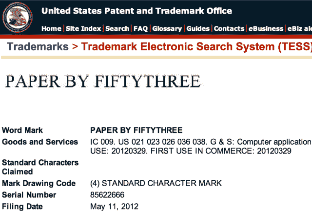
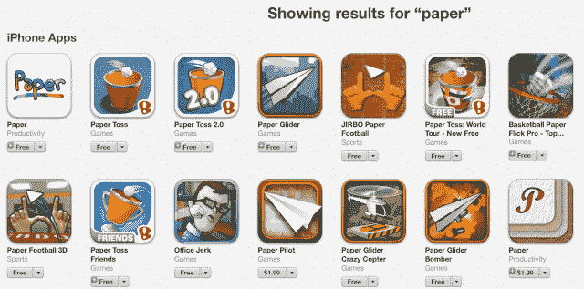

# 脸书“纸”可能击败商标投诉，因为绘图应用程序被注册为“纸由 53”| TechCrunch

> 原文：<https://web.archive.org/web/https://techcrunch.com/2014/02/03/facebook-vs-fiftythree/>

# 脸书“纸”可能击败商标投诉，因为绘图应用程序被注册为“纸由 53”

App Store 中有一大堆名为“Paper”的应用程序，但尽管绘图应用程序制造商 53 要求更改名称，脸书的新应用程序可能会名列榜首。一个问题是，fifty third 将其应用程序的商标注册为[“Paper By fifty third”](https://web.archive.org/web/20230404150328/http://tess2.uspto.gov/bin/showfield?f=doc&state=4803:r1pqgq.2.1)而不是“Paper”，虽然这是一个蹩脚的法律漏洞，但这可能足以让脸书保留这个名称。

今天早上，获得 1500 万美元资助的开发者 53 发表了一篇关于其 2012 年 3 月发布的应用的[博文](https://web.archive.org/web/20230404150328/http://tess2.uspto.gov/bin/showfield?f=doc&state=4803:r1pqgq.2.1)，解释道:

> “当我们在[2014 年]1 月 30 日和其他人一起得知脸书将发布一款同名应用——Paper 时，我们感到很惊讶……我们就他们的应用造成的混乱联系了脸书，他们为没有早点联系我们而道歉。但是一个真诚的道歉应该伴随着补救措施……脸书应该停止使用我们的品牌名称……脸书的故事将会怎样？他们会是欺负他们开发者的企业巨头吗？还是要敏捷，认识到一个错误，然后修正它？”

这是对这个问题的合理看法。[五十三的 app](https://web.archive.org/web/20230404150328/http://www.fiftythree.com/paper) 家喻户晓，深受喜爱。它获得了苹果 2012 年 iPad 年度应用奖。而且是在 App Store 首发。然而今天，脸书推出了一款内容阅读器，[美化了脸书客户端，名为](https://web.archive.org/web/20230404150328/https://techcrunch.com/2014/02/03/paper-now-available-for-ios-in-the-us-and-it-could-be-a-facebook-replacement/)“Paper”。

这一论点很容易忽略了 2011 年 10 月由工作室矛盾发布的另一款绘图应用 Paper，该工作室在商店中有 25 款其他应用。miSoft 在 2012 年 9 月[发布了另一款名为 Paper 的绘图应用。此外，还有 50 多个其他应用程序以 Paper 命名。纸娃娃，纸相机，纸忍者。](https://web.archive.org/web/20230404150328/https://itunes.apple.com/us/app/paper/id510847136?mt=8)

尽管如此，53 对脸书利用其规模欺负开发商的指控听起来是真实的。但是这可能无关紧要，因为 53 注册了它的商标。我问脸书是否有关于 53 投诉的声明，得到的答复是“无可奉告”。但如果投诉升级为正式诉讼，脸书可能会告诉法院“我们没有发布名为‘Paper By 53’的应用。”"

虽然这个职位在法律上有分量，但并不光彩。特别是考虑到脸书[在“book”](https://web.archive.org/web/20230404150328/http://www.techmeme.com/120323/p37#a120323p37)一词上主张其商标，以迫使其他公司更改 Lamebook 和 Placebook 等产品的名称。尽管在这些案例中，第三方直接借用了脸书利用“书”来推广自己品牌的方式。

在这里，这更像是一个巧合，脸书想要使用一个已经被 53 使用的名字，而不是试图伪造这个词的现有名称。但感觉上脸书仍在试图插手。

在法律斗争的情况下，法院将决定脸书的论文是否与 53 年的论文相似。因为它们是有不同图标的不同应用程序，脸书的没有绘图元素，Paper 是其他应用程序使用的通用名称，而且名称在技术上是不同的，脸书可能不会被迫改变。

马克·扎克伯格希望脸书成为现代报纸，无论你感兴趣的领域是什么，都能提供高质量的内容。尽管被另一个开发者通俗地使用，553 并没有这个名字的合法权利，所以“Paper”可能对脸书来说太诱人了而不能拒绝。