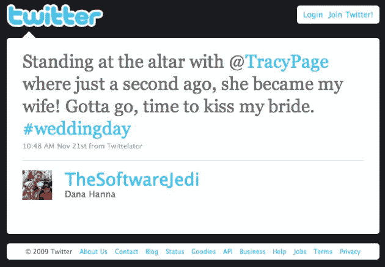

# 真的吗？

> 原文：<https://web.archive.org/web/https://techcrunch.com/2009/12/02/facebook-wedding/>

达纳·汉纳在圣坛上更新他的脸书和推特。他的新娘特蕾西不知道他要这么做。我肯定她很激动:

> 我不仅让我的客人感到惊讶，也让特蕾西感到惊讶，在我们的婚礼上，我拿出手机在脸书和推特上发了帖子。我把她的手机放在口袋里，所以当她要的时候，我可以递给她。除了部长和我自己，没有人知道这件事。

