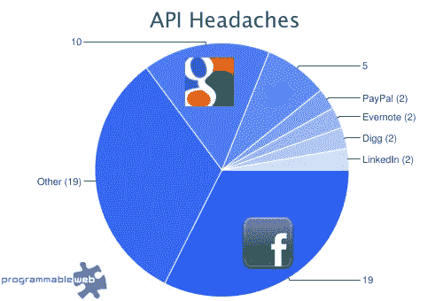
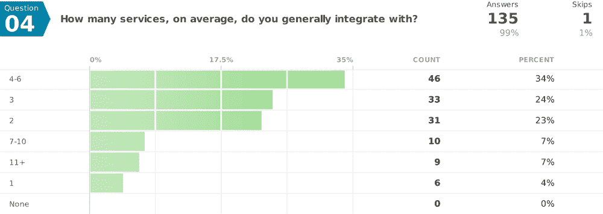

# 脸书在开发者调查中赢得“最差 API”

> 原文：<https://web.archive.org/web/https://techcrunch.com/2011/08/11/facebook-wins-worst-api-in-developer-survey/>

之前在 Hacker News 上发布的对 100 多名开发人员的调查，旨在确定哪些外部 API 最难集成到开发人员的项目中。胜利者……或者更确切地说，失败者？*脸书*。开发人员提到脸书 API 最多的是漏洞、糟糕的文档、永无止境的 API 更改、缓慢的响应时间以及其他令人头疼的问题。

谷歌 API 排在第二位，Twitter APIs 排在第三位。

*图片来源:[可编程网页](https://web.archive.org/web/20230205034010/http://blog.programmableweb.com/2011/08/11/survey-says-facebook-api-has-most-headaches-and-horror-stories/)*

当然，这三个服务也是当今开发人员中最受欢迎的，所以听到它们也是问题之首也就不足为奇了。当然，脸书、谷歌和 Twitter 的排名将会高于 Digg API，这种 API 如今很少出现。

但是脸书收到的投诉最多，开发者称它“坏了”，错误百出，提供的文档也很糟糕。Twitter 也收到了投诉，但它也是所有其他服务中最积极的评论。与此同时，对谷歌的投诉提到了被关闭或缺失的 API。

[根据进行](https://web.archive.org/web/20230205034010/http://blog.yourtrove.com/2011/08/11/api-integration-pain-survey-results/)[调查](https://web.archive.org/web/20230205034010/http://trove.polldaddy.com/s/api-pain)的照片聚合服务 Trove ，有大量关于当前 API 提供商的投诉。Trove 认为开发者应该得到更好的:

> 他们没有很好地为他们的开发者服务。有糟糕的文档。OAuth 之类的服务存在问题。API 会在没有警告的情况下随机更改。甚至没有类似的行业标准，只有每个人都能找到的最佳实践。作为开发人员，我们依靠这些 API 谋生，我们应该得到更好的。

**附加数据**

该调查的其他有趣结果与集成、开销和具体难题的细节有关。

例如，近三分之二的开发人员声称他们有 3 个或更多的服务集成，三分之一的人说他们使用了 4 到 6 个。9 名开发者称他们使用了 11 项或更多的服务。

【T2

令人惊讶的是，开发人员并没有发现服务集成的维护一年比一年糟糕，Trove 曾认为会是这样。这可能是由于随着时间的推移，如标准化和委托图书馆的改进，或者，Trove 承认，在他们的调查问题中措辞不当。

至于头疼吗？列举了很多，包括:

*   糟糕的文档
*   OAuth
*   错误处理能力差
*   缺少示例代码
*   缺乏测试环境
*   缺乏跨语言的标准化库
*   频繁更改/中断的 API(主要是脸书)
*   规范化数据以匹配内部数据结构
*   使用和滥用之间的界限
*   任意节流(服务之间的差异)
*   不同的标准(REST v SOAP v XML-RPC，XML v JSON v POST，版本控制 v not，等等。)
*   让服务与防火墙后的开发机器对话

Trove 表示，它将很快发布一项新的调查，以询问一些开发者告诉他们希望下次看到的问题。

*Additional Sources: [Programmable Web](https://web.archive.org/web/20230205034010/http://blog.programmableweb.com/2011/08/11/survey-says-facebook-api-has-most-headaches-and-horror-stories)*