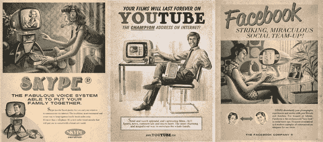
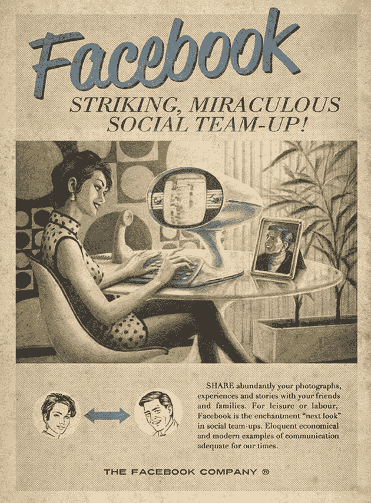

# 脸书，YouTube，Skype，《广告狂人》风格

> 原文：<https://web.archive.org/web/https://techcrunch.com/2010/08/06/facebook-youtube-skype-mad-men-style/>

# 脸书，YouTube，Skype，“广告狂人”风格

因为今天是星期五；巴西广告公司 Moma 为网络服务[脸书](https://web.archive.org/web/20230316031301/http://adsoftheworld.com/media/print/maximidia_seminars_vintage_facebook)、 [YouTube](https://web.archive.org/web/20230316031301/http://adsoftheworld.com/media/print/maximidia_seminars_vintage_youtube) 和 [Skype](https://web.archive.org/web/20230316031301/http://adsoftheworld.com/media/print/maximidia_seminars_vintage_skype) 制作了上述 60 年代风格的广告。作为 Maximidia 研讨会的“一切都变得很快”活动的一部分，这些广告在视觉上令人震惊，文案令人毛骨悚然(“Skype，能够让你的家人聚在一起的神奇语音系统”)。或者这只是古怪的葡萄牙语到英语的翻译？

无论如何，我迫不及待地想看看他们为 Twitter 拼凑了什么(“Twitter，像一只拥有神奇更新的小鸟一样歌唱！”) .下面更多互联网遇上复古。
【YouTube = http://www . YouTube . com/watch？v = iroyzrm 5s BM&HL = en _ US&fs = 1&w = 630】

图片:[世界广告](https://web.archive.org/web/20230316031301/http://adsoftheworld.com/media/print/maximidia_seminars_vintage_facebook?size=_original)经由[笑乌贼](https://web.archive.org/web/20230316031301/http://laughingsquid.com/fake-vintage-ads-for-facebook-youtube-skype/)