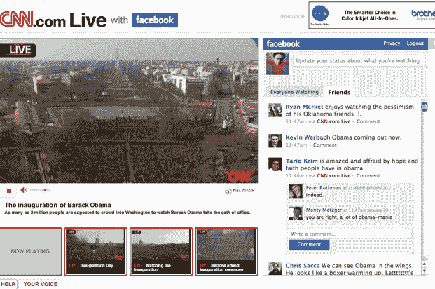

# 脸书的大日子:通过 CNN TechCrunch 有 150 万条与奥巴马相关的状态更新

> 原文：<https://web.archive.org/web/https://techcrunch.com/2009/01/20/facebooks-big-day-15-million-obama-wall-posts/>

# 脸书的大日子:通过 CNN 有 150 万条奥巴马相关的状态更新

今天可能是奥巴马日，但也绝对是脸书日——该公司将其[脸书连接](https://web.archive.org/web/20221209135936/http://www.beta.techcrunch.com/2008/05/09/facebook-responds-to-myspace-with-facebook-connect/)服务[很好地整合到了](https://web.archive.org/web/20221209135936/http://www.beta.techcrunch.com/2009/01/20/watching-the-inauguration-with-all-my-facebook-friends/)就职典礼的 CNN.com 直播报道中。脸书用户可以在观看比赛时登录脸书，阅读朋友(或任何人)的评论，并留下自己的评论。

我们在太平洋标准时间 10:15 更新了我们的[帖子](https://web.archive.org/web/20221209135936/http://www.beta.techcrunch.com/2009/01/20/watching-the-inauguration-with-all-my-facebook-friends/),更新了脸书发来的一些用户统计数据——那时已经有超过 600，000 条状态更新从直播中发布。

我们要求今晚更新统计数据，并得到了它们。事情肯定没有停止。从今天早上开始，超过 150 万条状态更新通过 feed 发布(太平洋标准时间上午 8:30 有 20 万条)。在直播期间，平均每分钟有 4000 条状态更新，在奥巴马演讲期间每分钟有 8500 条。

对脸书来说，那是一个糟糕的广告。干得好。