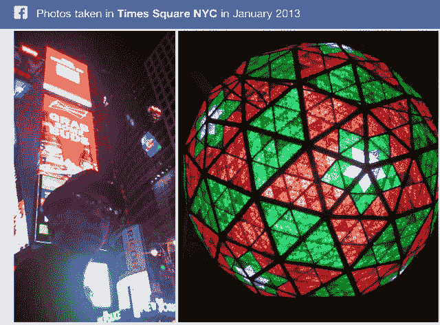

# 脸书的“肮脏的喜欢”最初可能会误导图形搜索，但脸书也有其他好的信号 TechCrunch

> 原文：<https://web.archive.org/web/https://techcrunch.com/2013/01/18/facebooks-dirty-likes-may-mislead-graph-search-initially-but-facebook-has-other-good-signals-too/>

显然我“喜欢”OfficeMax、Folgers、JCPenney、Kraft 等几个大牌。至少，根据脸书的说法，我有。除了，这是错的。这并不是说我不喜欢这些品牌，真的(也许除了 Folgers，我是说，恶心)。但事实是，我只是对他们漠不关心。我为什么喜欢他们？我不记得了。我大概看到了优惠券。可能是免费赠品或竞赛。我很无聊，只好点击“喜欢”进入绘图。这是脸书用户的普遍情况，但并不是一个大问题。然而，对脸书来说，却是如此。

随着[脸书现在在其自己的结构化数据](https://web.archive.org/web/20221005185108/https://beta.techcrunch.com/2013/01/15/facebook-announces-its-third-pillar-graph-search/)基础上推出搜索引擎——方便的是在关闭用户选择退出搜索的能力之后——现在更需要思考脸书的“超过一万亿个连接”的含义，以及它们对创建它们的人有多大的代表性。

总的来说，脸书的“喜欢”数据可能描绘了我的公众自我的相对准确的画面——我喜欢技术、应用、星球大战、电视、家庭活动，以及关于职业母亲要喝多少酒才能保持清醒的笑话(提示:很多)。但是当一个一个检查的时候，有很多垃圾数据在里面。

最初，当人们开始通过谷歌转向脸书搜索时，他们会搜索个人感兴趣的东西，比如老照片、旅行地点、新的酒吧或餐馆、有共同兴趣的当地单身人士等等。但是，接下来，你可以想象脸书图形搜索也成为消费者购物体验的一部分。

比方说，我正在寻找一台新的烘干机、一台高清电视、一张新的信用卡，或者甚至是一家好的寿司店，我想知道我的脸书图可以推荐什么。现在的问题是，脸书在准确提取信息方面做得不好*。“喜欢过 X 的朋友”不是推荐。“在 Y 场馆签到的朋友”也不是。*

 *至少在入住方面，脸书通过其在[附近的功能](https://web.archive.org/web/20221005185108/https://beta.techcrunch.com/2012/12/17/as-facebook-launches-nearby-foursquare-continues-its-focus-on-discovery-with-latest-ios-update/)在一定程度上解决了后一个问题，该功能最近一直在提示用户推荐餐厅、酒吧或其他五星级酒店。这个数据也不是完美的，因为一些朋友的评级比其他人的评级更有价值，这是由多种因素决定的——例如，他们的口味、偏见、他们是否了解葡萄酒，或者与用户自己的口味相似。但这是一个开始。

然而，在“喜欢”方面，数据更加模糊。

[group me 的商业发展主管史蒂夫·切尼](https://web.archive.org/web/20221005185108/http://www.crunchbase.com/person/steve-cheney)，在一篇深思熟虑的、悲观的帖子中更详细地解释了这个问题:“[图形搜索的肮脏承诺和脸书‘Like’的骗局](https://web.archive.org/web/20221005185108/http://stevecheney.posterous.com/graph-searchs-false-promise-and-the-con-of-th)”整本书都值得一读。切尼在信中说:

> 然而事实是，查询意图和你对兴趣和地点的社交互动之间的联系比 FB 希望你相信的要弱得多。
> 
> 在计算机体系结构中，他们称过时的数据为“脏”数据。访问脏数据不好，浪费时间，弊大于利。在这种情况下，构成图搜索的大部分结构化数据就是:*完全不相关和肮脏的*。
> 
> 事实证明，FB 中包含的对象和兴趣之间的链接有多达一半是不干净的——即，在 like 和对象之间没有真正的亲和力，或者它是陈旧的。不要介意数据没有真正代表用户的意图…但是用户甚至没有“喜欢”她喜欢的东西。

他继续解释说，这个问题是由脸书“喜欢”系统的工作方式造成的。该公司告诉品牌，如果用户喜欢该品牌在脸书上的页面，他们就会在新闻订阅中看到自己的帖子。因此，这些品牌花了大笔广告费来获得粉丝。切尼写道:“大广告客户被告知，要把 50%的广告收入完全花在获取粉丝上。”。他称之为“广告公司领域的肮脏小秘密”

 这就是为什么今天，脸书用户不能*而只能*申请优惠券、获得免费样品、参加比赛、了解限时特卖等。通过一个品牌的页面——他们被迫首先喜欢这个页面。这就建立了品牌和用户之间的联系。现在，脸书正在挖掘这种联系，打造自己的搜索引擎。谷歌有 PageRank。脸书有“喜欢”的数据、签到、帖子、评论和照片。[这里有一些你可以用 Facebook Graph Search 执行的查询，来了解一下它是如何工作的](https://web.archive.org/web/20221005185108/https://beta.techcrunch.com/2013/01/15/what-can-i-search-for-on-facebook/)。

##### **一个“喜欢”只是一个信号，脸书还有更多**

尽管如此，尽管切尼对脸书的“肮脏数据”有所指，但我认为这种观点也低估了脸书的创新能力。是的，有些数据是坏的。但不是全部。

最重要的是，似乎很明显，在商业和品牌的背景下，脸书这样的公司最终将成为脸书搜索结果排名算法中的一个信号。正如谷歌等引擎依靠成千上万的信号来确定一个链接出现在搜索结果中的位置，脸书也可以转向其他方式来确定任何特定“喜欢”的价值。例如，对于一家餐厅，它不仅可以知道你是否喜欢它，还可以知道你什么时候入住，你多久回来一次，你和谁在一起，他们多久回来一次，你对它的评价如何，你朋友的朋友和朋友对它的评价，等等。

正如 TechCrunch 的 Josh Constine 最近指出的那样，[由于照片的地理标签(照片拍摄的位置)，甚至用户上传的照片也可以转化为推荐](https://web.archive.org/web/20221005185108/https://beta.techcrunch.com/2013/01/17/facebook-photos-record/)。一张照片上写着“我在那里”，这通常隐含着一种有趣的元素。正如乔希所说，“我没有看到很多人从车管所上传照片。”

【T2

不过，就品牌而言，确定一个爱好的价值要困难得多。然而，脸书的广告网络脸书交易所[将第一个基于 cookie 的重定向广告带到了脸书](https://web.archive.org/web/20221005185108/https://beta.techcrunch.com/2012/08/25/facebook-exchange-retargeting/)，脸书可以获得关于用户行为的其他信号，以便更好地研究“喜欢”的含义。例如，脸书可以了解用户是否访问了一个品牌的网站，他们的访问是何时发生的，这些访问是否会将他们带到广告商的脸书页面(例如，在看到脸书的广告后)，然后引发用户的“喜欢”

脸书也可以将脸书交易所移植到手机上，这将带来更多的数据，也许有一天会包括地理定位。这将解决混乱的“签到”问题。(签到显然是一种手动的、对隐私敏感的获取位置数据的方式，如果用户允许它在后台运行，应用程序可能*知道。)*

诀窍在于找到合适的方法，将所有这些不同的信号纳入一个有意义的算法，并确定适当的相关性。脸书仍然严重缺失与用户金融交易相关的信息，这是点击“喜欢”的最终结果，至少在品牌眼中是这样。目前，通过与 Datalogix 的关系，[可以访问一些购买数据，但这可能仅限于杂货店购买等事情——脸书通过 Datalogix 忠诚卡数据集接收的数据。脸书显然需要更多这类信息。](https://web.archive.org/web/20221005185108/https://beta.techcrunch.com/2012/10/01/facebook-ads-frequency/)

脸书也不一定知道你是否在你喜欢的餐馆吃过饭，不像你登记入住、张贴地理标签照片或评论它的时候。它也不知道你在那里花了多少钱。这就是为什么如果谷歌的谷歌钱包移动支付服务成为主流，它至少可以在这一部分胜过脸书:结束循环。

尽管如此，脸书确实通过 Open Graph 获得了一个相对强大的数据集，它不仅告诉它人们喜欢什么，还告诉它他们做什么。Open Graph 数据来自任何与脸书自动共享的第三方应用程序，提供关于你的媒体消费行为(如乐队、电视节目、电影、书籍)的信息，以及从食物或旅游应用程序收集的信息，它也可能有来自当地企业的大量信息。

说到底，我认为脸书的图形搜索现在就像是在看一个想法的骨架，真的是有一天会成为一个更成熟的搜索产品的原始骨架。今天，肮脏的数据可能会比比皆是。但是当有一万亿个联系需要检查(并且还在增长)时，也有可能从垃圾中找到高质量的金块。

*图片来源:[sofiabudapest/Flickr](https://web.archive.org/web/20221005185108/http://www.flickr.com/photos/sofiabudapest/5925462073/)*

*补充报道作者:乔希·孔斯蒂内**