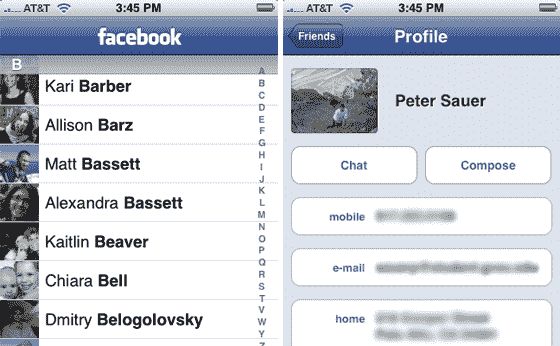

# 脸书的 iPhone 应用程序(几乎)取代了我的联系人列表

> 原文：<https://web.archive.org/web/https://techcrunch.com/2008/07/10/facebooks-iphone-app-almost-replaces-my-contacts-list/>

# 脸书的 iPhone 应用程序几乎取代了我的联系人列表

我们所有的 iPhone 狂热者都刚刚接触到新的应用程序，但我已经找到了一个我确信在未来几个月内不可或缺的应用程序:脸书的新应用程序。

为什么这么引人注目？因为它几乎消除了在我的手机上维护一个单独的联系人列表的需要。虽然脸书为 iPhone 开发的网络应用程序[足够酷](https://web.archive.org/web/20221209121045/http://www.beta.techcrunch.com/2007/08/15/facebook-iphone-ultrahype/)，但原生应用程序基本上把脸书变成了一个移动目录，里面有你朋友的丰富信息。

如果你真的想用脸书来追踪你的朋友，你可能永远都不需要点击“电话”图标来给他们拨号。点击脸书图标，进入“朋友”标签。你会看到你所有的脸书朋友都被展示出来，当你点击他们的名字时，他们的联系信息就会出现在 iPhone 的习惯用户界面上。

轻按朋友的电话号码给他们打电话(或点击他们的电子邮件地址写信)。这种方法唯一失败的时候是当一个朋友决定不在他们的个人资料中输入必要的联系信息时(在我看来，如果你正确设置了隐私设置，这是不必要的谨慎)。

该应用程序有可能消除对 iPhone 其他两个原生功能的需求:短信和电子邮件。这款应用内置了脸书聊天功能，你可以给在线的朋友发送即时消息(无论是在电脑上还是在手机上)。一旦脸书找到一种方法让你保持“在线”,即使在应用程序关闭时也可以聊天——并将聊天与新的[推送通知服务](https://web.archive.org/web/20221209121045/http://www.beta.techcrunch.com/2008/06/09/the-games-begin-live-coverage-of-apple-wwwc-event-in-san-francisco/)挂钩，这样你就可以在消息进来时知道——我就离节省每月在& T 支付的额外 10 美元又近了一步，这样我就可以发送价格高得离谱的短信了。脸书应该正在开发一个聊天到短信(或短信到短信)的转换功能，可以用来和我那些没有 iPhones 或任何其他电子邮件智能手机的朋友发信息。

至于电子邮件，脸书的消息系统也内置在应用程序中，这样就没有必要通过电子邮件发送冗长的信息(如果你可以通过名字查找朋友的电子邮件地址，谁还想知道他们的地址呢？).

乔·休伊特[也在脸书的博客上建议](https://web.archive.org/web/20221209121045/http://blog.facebook.com/blog.php?post=22389032130)在接下来的几个月内，该应用程序也将成为[位置感知](https://web.archive.org/web/20221209121045/http://www.beta.techcrunch.com/2008/06/04/location-technologies-primer/):

> iPhone 版脸书只是未来的一瞥。例如，iPhone 有能力找到你所在的位置，我们正在寻找方法让你选择分享你的位置和发现附近的朋友。我们正在开发这个和其他几个令人兴奋的新功能，我们将在未来几个月内发布。

看起来，Loopt 和所有其他基于位置的社交网络都将被镇上最大的玩家挤兑。

鉴于这一强劲的开端，我不担心脸书会在 iPhone 2.0 世界里茁壮成长。它只需要找到一种方法[让它的开发者参与进来](https://web.archive.org/web/20221209121045/http://news.cnet.com/8301-13577_3-9987302-36.html?hhTest=1)，因为这个平台在这个应用的第一个版本中是明显缺失的。

点击了解如何安装新的 iPhone 软件(在新旧机型上都适用)[。祈祷在更新过程中不会丢失任何数据(不过我没有遇到任何问题)。还可以看看新的 MySpace iPhone 应用程序，虽然功能很强大，但不能取代联系人列表或提供聊天功能。](https://web.archive.org/web/20221209121045/http://www.beta.techcrunch.com/2008/07/10/ok-iphone-users-we-are-ready-to-roll-with-20/)

**更新:**如果你想给一个 iPhone 应用截图，请按照这里[的说明](https://web.archive.org/web/20221209121045/http://www.macworld.com/article/134391/2008/07/iphone_screen_shots.html)操作。

**更新 2:** 看起来脸书的 iPhone 应用程序不知道如何恰当地呈现带有引文的信息。希望这些明显的错误能在接下来的几天内被解决。