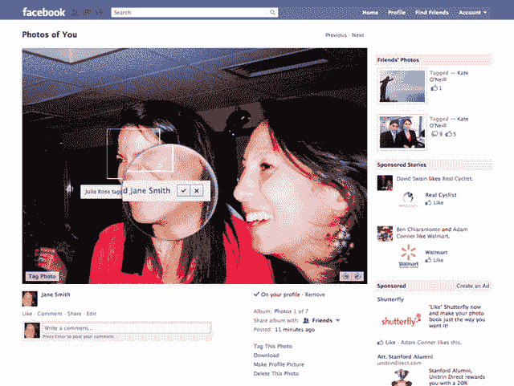
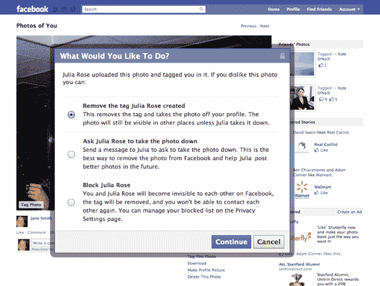
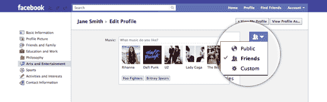
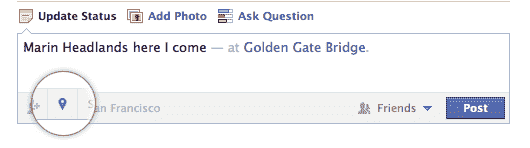

# 脸书的大规模厨房水槽更新:照片标签批准等等 TechCrunch

> 原文：<https://web.archive.org/web/http://techcrunch.com/2011/08/23/facebooks-massive-kitchen-sink-update-photo-tag-approvals-and-so-much-more/>

地狱已经冰封，猪已经飞走，现在可以在照片出现在你的个人资料之前批准你在脸书上标记的照片。

暂停。需要的话喝一杯。如果你今天早上在街上听到烟火，你知道为什么。

脸书本周推出了一个新的更新，它包含了相当于厨房水槽的修复、调整和新术语，旨在*“让你更容易与你想要的人分享”*。简而言之，今天的版本修复了该网站多年来一直存在的许多最大的问题(和隐私问题)。所以让我们开始吧。

首先，我要重复一遍，因为人们早就想这么做了，现在可以在标签出现在你的个人资料之前批准标签，包括照片标签。

这是一个大问题，也是自从 Photos 首次推出以来人们一直要求的功能。对于你的朋友为你添加标签的照片，该功能默认为“关”，但至少它还在。

但是为什么是现在？脸书陈述了他们最终实现这一选项的理由，这与另一个新功能有关:现在可以在照片中标记你不是朋友的人。

如果你曾经上传过婚礼、聚会或其他活动的相册，而你只是模糊地认识一些参与者，那么你可能会在脸书照片中遇到一个令人讨厌的怪癖:你只能在你在脸书上加为好友的照片中标记人。这往往会让你和那些你毫不在乎的人成为朋友。

通过此次更新，脸书正在解决这一问题——任何人都可以在照片中为其他人添加标签，但有一点需要注意:在这些标签发布到你的个人资料之前，你可以随时批准它们。因此推出了标记队列。事实上，对于非好友标记的照片，实际上没有办法关闭这个批准过程。

正如我之前提到的，默认情况下，你的朋友为你添加标签的照片会自动添加到你的个人资料中，就像现在这样。但是你也可以将这些照片放入你的队列中。

当您查看您的个人资料时，队列本身会显示在您的个人资料照片下方，并且正如您所预期的那样工作。万岁！

* * *

标签工作方式的另一个调整涉及到人们给 T4 的照片添加标签的方式。从历史上看，如果你的一个朋友在一张不讨人喜欢的照片上给你加了标签，从你的个人资料(或“加标签的”相册)中删除它的唯一方法就是简单地取消标签。但事实证明，大多数人并不一定在乎在这些照片下有他们的名字和超链接——他们只是不想让这些照片出现在他们的个人资料上。

因此，现在可用的去标签选项反映了这一点:最突出的选项将是从您的个人资料中删除照片，而一个单独的对话框将允许您完全去标签。这个对话框还可以很容易地发送预先生成的消息，要求朋友删除某张照片，或者向脸书本身报告该照片被滥用。

* * *

另一个表面上看起来很小的调整是:**脸书现在正在改变状态更新的措辞，从“每个人”改为“公开”**。这让我冷嘲热讽，因为从第一天开始，“每个人”这个词就很明显是模糊的(它很容易指“脸书的每个人”，而不是“整个互联网”)。

这背后有很多故事，涉及到脸书[迄今为止最令人震惊的](https://web.archive.org/web/20230204120134/https://techcrunch.com/2009/12/09/facebook-privacy/)隐私相关举动。那是 2009 年 12 月，网站提示所有用户更新他们的隐私设置。如果用户之前没有调整过隐私设置(大多数人都是这样)，脸书会将默认共享设置从朋友的朋友(这意味着网站上相对较少的人可以看到他们)改为“所有人”(这意味着所有其他脸书用户，以及脸书允许访问的任何搜索引擎和第三方网站，也可以看到他们)。

我的直觉是:脸书认为“公开”这个词在这场隐私泄露事件中用起来太吓人了，所以用了“每个人”。既然人们已经习惯了这个想法，他们会用这个实际上有意义的词。

* * *

状态更新的创建和显示方式还有其他一些重要的变化。首先，直接借鉴 Google+的剧本，现在每个发布的状态更新都清楚地表明它是否仅对用户的朋友、公众或“自定义”可见(如果他们只与一组选定的朋友分享，那么“自定义”选项将会显示，尽管你看不到具体的*谁*包括在该组中)。

当你在起草一份更新时，你将与谁分享内容(同样，这与 Google+类似)也变得更加明显。模糊的锁图标不见了，取而代之的是表示朋友、公共或自定义的图标。

* * *

另一个重大变化是:脸书正在彻底改造其 Places 产品，该产品现在不再强调类似 Foursquare 的签到功能。脸书说，问题是，很多人都想在事后地点标记内容，或者谈论他们想去的地方。目前，集成在脸书 iPhone 和 Android 智能手机应用程序中的 Places 产品只能让你在某个特定地点的几个街区内签到，你不能随时从过去或未来签到。从本周开始，你将能够轻松地将位置与任何更新相关联，即使你不在该位置附近。

因此，现在“地点”图标将被替换为“附近”图标，这样你就可以看到你的朋友发布的与你正在查看的区域相关的内容(这有点令人困惑，脸书没有详细说明该应用程序现在的具体表现)。基于位置的交易的分配方式肯定会发生重大变化。以前，场馆可以向签到的用户奖励交易。现在，在某个地点附近标记一条内容的用户将从附近的地点*获得*推送给他们的交易。再说一次，我还没有看到它的实际应用，但它与去年秋天才推出的 Places 产品有很大的不同。

* * *

另一个与位置相关的变化是:脸书现在会提示用户在所有更新中包含一个城市级别的位置标签(例如，如果我是在纽约市写的，它会提示我在状态更新中包含这个标签)。如果你不感兴趣，你可以禁用它，但是城市级别的位置对大多数人来说可能不会有很大的隐私问题。

最后，用户可以直接从他们的个人资料中更容易地调整他们的隐私控制，设置显示在屏幕上，而不是隐藏在菜单中。这包括一个“查看个人资料为”选项，它现在突出显示在你的个人资料上(就像在 Google+上一样)。

* * *

在与此次更新的一位产品负责人的简报中，我问他们为什么现在做出所有这些改变——用户多年来一直要求其中的一些东西，如预先批准照片标签的能力。她的回应与脸书一直努力使网站更容易使用并提供更容易的隐私控制类似，当然，这几乎与时机无关。是的，脸书有点好斗。但是提供挂起的 post 队列显然是他们很久以前就决定反对的事情。

那么是什么改变了呢？显而易见的答案是 Google+。脸书对我的断言的回应是，脸书*希望*能够在 Google+推出后的这段时间内构建这些功能，但这些改变的工作实际上在大约六个月前就开始了。这可能是对的一半。脸书知道谷歌将推出一个社交网络，试图强调其所有的缺陷——注意这些功能中有多少已经在 Google+上直播——所以它先发制人地开始努力解决让人们讨厌脸书的事情。

无论如何，这些都是好的改变，它们让脸书变得更好。

请注意，虽然脸书今天宣布了这些功能，并将通过交互式提示教育用户如何工作，但它们要到周四才会开始推出。