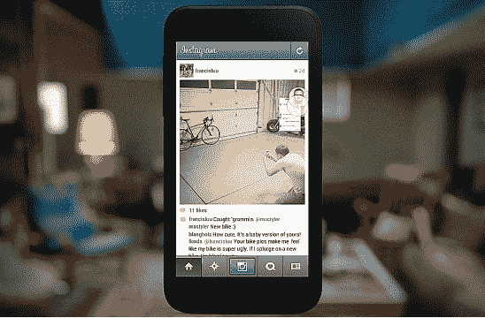

# 脸书的新“家”将重点放在与聊天头的信息交流上

> 原文：<https://web.archive.org/web/https://techcrunch.com/2013/04/04/facebooks-new-home-puts-focus-on-messaging-with-chat-heads/>

在今天的脸书“Android Home”活动上，该公司推出了一款全新的主屏幕，可以安装在任何 Android 设备上，名为 Home。

Home 将您的智能手机从一个以应用程序为中心、以任务为驱动的设备转变为一个以人为中心的工具，让您无需轻轻一击就能了解您的朋友和关系。但脸书致力于保留的手机的一部分是信息，Home 显然非常强调这一点。

扎克解释说，消息传递不应该像其他任何应用程序一样对待，尽管在当前的生态系统中它经常被这样对待。也就是说，Home 让你只需轻轻一扫就能进入消息应用，但它远不止于此。

当你与某人交谈时，他们的图标实际上就在主屏幕上，便于访问。脸书称之为聊天头，这可能是整个功能中最糟糕的部分。

如果你翻到另一个应用程序，比如游戏或 Instagram，“聊天头”(可以说)就在角落里，准备好等待互动。聊天头甚至有一个未读计数，显示你错过了多少张照片。

假设你想和一个一直在发消息的朋友分享一张 Instagram 照片。聊天头让你只需轻轻一点，就能从图片转到分享。

Chat Heads 面临的主要问题是，每次收到消息时，你都必须做出决定。你是停下手头的工作打开它，还是继续玩愤怒的小鸟？

Chat heads 可以让你在打开任何邮件之前预览它，让你决定是否需要打开它。如果它很有趣，你可以点击进入聊天窗口，而不用离开愤怒的小鸟、一篇文章或你的电子邮件。

对话只是停留在你的原始内容上。当你完成后，你可以简单地向上移动手势来折叠聊天，聊天头将一直留在你的屏幕上。

你可以同时打开许多聊天窗口，尽管可能会有点混乱。在这一点上，你可以简单地通过拖放操作来聚集聊天标题，并通过向下滑动来拂去它们。你也可以一次拂去一个聊天头像。毕竟，让你朋友的脸一直盯着你看会有点奇怪。

从我们可以看到，任何是你的脸书朋友的人都可以作为聊天头出现。

根据脸书的说法，Home 将在 4 月 12 日“大约一周内”推出，目前还不清楚哪些设备将立即可用。

【T2