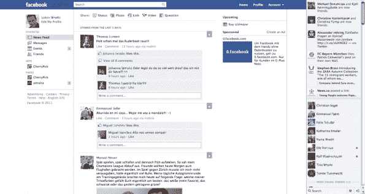
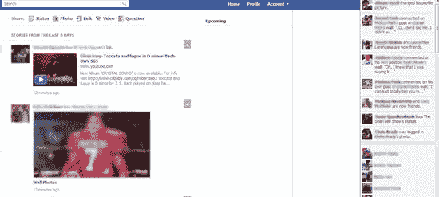

# 脸书新推出的迷你新闻订阅面向更多用户

> 原文：<https://web.archive.org/web/http://techcrunch.com/2011/08/19/facebooks-new-mini-feed-shows-up/>

# 脸书新推出的迷你新闻订阅面向更多用户

上周，我们报道了几个脸书设计的变化，包括对脸书聊天和侧边栏的更新。今天，看起来新的“迷你”新闻源正在向更多用户推出。关于改版后的脸书的提示开始滚滚而来，其中包括页面右侧的微型实时新闻。在某些情况下，[这个提要被标记为](https://web.archive.org/web/20230204150621/http://www.allfacebook.com/facebook-rolling-out-ticker-2011-08)“Ticker”

新的实时自动收报机显示你的脸书朋友的所有活动，这与今天脸书新闻的运作方式不同。在主新闻提要中，先进的算法被用来显示最有趣和相关的更新，基于许多因素，包括喜欢、评论和你与这些朋友互动的频率。

然而，滚动条显示一切:喜欢、评论、状态更新、新照片、你喜欢的页面的更新……换句话说，作品。

**更新**:

脸书对新功能的声明:

*“我们目前正在测试 News Feed 中的一项功能，该功能可以让人们看到他们的朋友在评论和“喜欢”什么，因为这些操作正在脸书上进行。这个测试包括了一小部分脸书用户，仅仅是百分之几。在接下来的几周里，随着我们从这项测试中了解到更多，我们将继续进行改进，并可能将它推广到更多人。”*

*谢谢， [@gizmosachin](https://web.archive.org/web/20230204150621/http://twitter.com/#!/gizmosachin/status/104451593713369089) 和[罗伯特](https://web.archive.org/web/20230204150621/http://dickbert.wordpress.com/2011/08/19/new-secret-facebook-layout-for-stream-revealed-today/)*