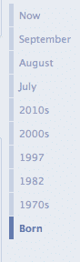
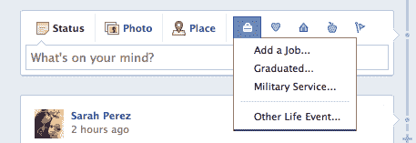

# 脸书的新时间线:数据进去了，但它能离开吗？TechCrunch

> 原文：<https://web.archive.org/web/http://techcrunch.com/2011/09/26/facebooks-new-timeline-data-goes-in-but-can-it-ever-leave/>

在上周的脸书开发者大会 f8 上，[公司推出了](https://web.archive.org/web/20230203060414/https://techcrunch.com/2011/09/22/live-from-facebooks-2011-f8-conference-video/)全新设计的个人资料页面，现在被称为[脸书时间线](https://web.archive.org/web/20230203060414/https://techcrunch.com/2011/09/22/facebook-timeline/)。新的时间线不再是状态更新、分享和照片上传的单一列流，而是让你更深入地了解你的过去。

你可以通过右侧导航来浏览你的时间线，让你点击月份和年份，一直回到你出生的那一天。通过更新后的状态更新框旁边的新“生活事件”菜单，你可以填写生活历史中缺失的部分，包括结婚、离婚、出生和死亡、工作变动、搬家、医疗事件、成就、旅行和其他任何你想记录的内容。(后者得益于“其他生活事件”选项，可以选择脸书提供的下拉列表中没有列出的任何内容)。

对于那些花时间回去仔细记录他们的过去的人来说，最终的结果是一个反映你生活中主要时刻的在线数字剪贴簿。这很容易做到，而且结果令人信服。但是你能把这些数据从脸书调回来吗？还是会永远被困在那里？

去年秋天，[脸书推出了](https://web.archive.org/web/20230203060414/https://techcrunch.com/2010/10/06/facebook-now-allows-you-to-download-your-information/)[下载你的信息](https://web.archive.org/web/20230203060414/https://www.facebook.com/download)功能，让用户下载一个 zip 文件，包括他们的照片、相册、墙贴、状态更新、好友列表、笔记、事件和消息。这个选项可能还不为普通脸书用户所知，它旨在反驳谷歌的说法，即脸书将你最有价值的社交数据困在其墙内。最大的担忧过去是，现在仍然是，获取你朋友的电子邮件地址。(脸书允许你出口它们，但是[只有在朋友允许的情况下](https://web.archive.org/web/20230203060414/https://techcrunch.com/2011/08/11/clever-girl-facebook-lets-you-export-friends-email-addresses-but-makes-it-opt-in/))。

由于这种限制，到今天为止，电子邮件地址仍然是脸书档案馆明显缺失的一部分。

也失踪了？时间轴数据。

 在测试中，我导出的脸书数据包括了 2009 年的墙贴。然而，在脸书网站上，我可以更深入地研究我的历史，一直追溯到大约 2006 年的状态更新。

像一个数字考古实验，新的时间线功能让你一瞥你最早的脸书使用。例如，我 2006 年的许多状态更新只是一个单词(例如，“在线”)或一个短语(“去三藩市”)，作为对脸书当时提示的回应(“莎拉在…”)

哦，脸书已经走了多远。

但是在导出的文件中，奇怪的是，这个旧数据的宝库不见了。

此外，在填写了一些重要的生活事件(例如，我的婚姻、我孩子的出生)后，我再次使用“下载您的信息”功能导出了我的脸书数据。不足为奇的是，这些事件也没有包括在导出中，尽管它们属于导出所包括的年份范围。

有人可能会说[开发者版本的时间线](https://web.archive.org/web/20230203060414/https://techcrunch.com/2011/09/22/how-to-enable-facebook-timeline/)仍然是一项正在进行中的工作，我们无法确定什么数据将会或不会出现在脸书的下载中，直到这些变化对所有用户生效。我当然希望是这样。

也就是说，值得注意的是[脸书关于导出您的数据的常见问题解答](https://web.archive.org/web/20230203060414/https://www.facebook.com/help/?faq=202639089780201)已经更新，在提到您的脸书个人资料数据时，包括了“时间线”这一措辞。考虑到这一点，我们期望导出的数据实际上会包含所有的数据，包括新的时间线上的“生活事件”

到今天为止，还没有。(除非我遇到了某种错误)。

以后会吗？未知。多次要求脸书澄清这一问题都没有得到答复。

可悲的是，即使脸书选择不把你的所有数据都包含在导出的档案中，也很少有人会在意。脸书的用户一次又一次地证明，该网络可以做任何它想做的事情，无论是重大的重新设计还是严重的侵犯隐私。没关系，人家不会走的。这就是脸书和网络效应的力量。

但是通过限制您可以导出的数据量(让我们面对现实吧——您现在可以将这些数据带到哪里呢？Google+？)，脸书只是增加了对用户的控制，现在还包括他们的生活历史和记忆。

当然，你可以争辩，就像我以前的同事弗雷德里克·拉迪诺瓦最近在 T4 做的那样，你在脸书分享的东西本身并不是“你生活的故事”。直到今天，这仍然是事实。但是，当新的时间轴功能推出并被主流接受时，脸书个人资料将比任何其他网络或网站，包括个人博客，更接近于我们生活的虚拟镜子。

想到你的数据——一生中珍贵的个人数字档案——将只属于脸书，在网站上没有可识别的出口，真是令人不安。