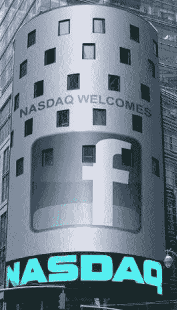

# 脸书在 NASDAQ TechCrunch 的开盘时间被推迟

> 原文：<https://web.archive.org/web/https://techcrunch.com/2012/05/18/facebooks-opening-trade-has-been-delayed-by-nasdaq/>

# 脸书在纳斯达克的开盘时间被推迟了

脸书在纳斯达克的开盘时间被推迟了。我们不知道为什么，但我们听到了混合的报告，涉及散户投资者出乎意料的高需求和取消订单的问题。正如我们大约 20 分钟前在一篇文章中解释的那样，该交易的承销商正在开会，试图设定一个开盘价。

但由于需求的意外变化，似乎做市商在确定开盘价方面存在问题。他们可以选择以 5 分钟为增量推迟报价，直到找到最终价格。

纳斯达克执行副总裁兼全球企业客户集团负责人布鲁斯·奥斯特(Bruce Aust)表示，这种情况并不罕见，最近在 Splunk 等受欢迎的 IPO 中也发生过。早期的消息是，我们正在考虑 42 美元的价格，或略高于 10.5%的涨幅。这将给脸书带来 1150 亿美元的估值。

*~ TechCrunch 关于脸书 IPO 的最佳报道~*

**[视频&照片:脸书 CEO 马克·扎克伯格在纳斯达克敲响钟声](https://web.archive.org/web/20221006100651/https://beta.techcrunch.com/2012/05/18/photos-facebook-ceo-mark-zuckerberg-rings-in-the-nasdaq-bell/)**

这里没有首次公开募股:脸书交易价格略高，约为 40 美元

**[脸书的主要高管和股东:每个人都值多少钱？](https://web.archive.org/web/20221006100651/https://beta.techcrunch.com/2012/05/18/facebook-what-are-the-main-players-shares-worth/)**

**[扎克伯格收到帽衫，在 IPO 前的讲话中说“我们的使命不是成为一家上市公司”](https://web.archive.org/web/20221006100651/https://beta.techcrunch.com/2012/05/18/zuckerberg-opening-remarks/)**

**[脸书如何黑掉纳斯达克按钮](https://web.archive.org/web/20221006100651/https://beta.techcrunch.com/2012/05/18/how-facebook-hacked-the-nasdaq-button/)**

**[Zynga 股票在脸书 IPO 期间狂飙——大跌，然后回升](https://web.archive.org/web/20221006100651/https://beta.techcrunch.com/2012/05/18/zynga-share-price-facebook-ipo/)**

[**脸书说讨厌的人会讨厌，喜欢的人会喜欢**](Facebook%20Says%20Haters%20Gonna%20Hate,%20Likers%20Gonna%20Like)