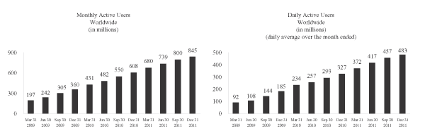
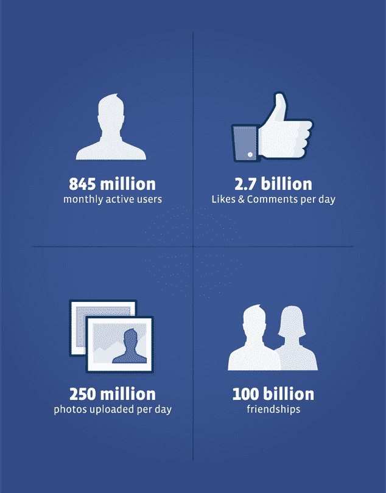

# 脸书的 S-1 显示:每月有 8.45 亿用户，一半以上是日常用户，一半是移动用户 

> 原文：<https://web.archive.org/web/https://techcrunch.com/2012/02/01/facebooks-s-1-845-million-users-every-month-more-than-half-daily-and-nearly-half-mobile/>

# 脸书的 S-1 显示:每月有 8.45 亿用户，一半以上是日常用户，一半是移动用户

作为上市申请的一部分，脸书刚刚披露了一些新的用户数据，显示了它的规模有多大。

截至去年 12 月，其月活跃用户数为 8.45 亿，日活跃用户数为 4.83 亿，同比分别增长 39%和 48%。手机现在也占了用户群的一半，每月活跃用户数为 4.25 亿。一些更模糊的其他统计数据:截至去年年底，有 1000 亿个朋友连接，在今年的最后三个月，每天有 27 亿个赞和评论。

总而言之，这基本上与该公司以前分享的内容相吻合。该公司在 9 月份表示，其拥有约 8 亿 mau。

[")](https://web.archive.org/web/20230211202406/https://techcrunch.com/wp-content/uploads/2012/02/g287954g71g62-1.jpg)

关于这些数字的另一点是，脸书对它所计算的内容提供了相当广泛的说明:

本招股说明书中显示的月活跃用户数(mau)和日活跃用户数(dau)基于公司内部数据，我们在管理业务时使用这些数据。我们相信我们的 MAU 和 DAU 数字是合理的估计，我们采取措施提高其准确性，如消除已知的虚构或重复的帐户。衡量全球大量在线和移动用户的使用情况存在固有的挑战。例如，可能有人违反我们的服务条款，拥有多个脸书帐户，尽管我们努力检测和制止此类行为。另一个例子是，某些移动设备上的应用程序可能会自动联系我们的服务器进行定期更新，而无需用户采取任何行动，这种活动可能会导致我们的系统将与此类设备相关联的用户视为脸书的活跃用户。我们估计，截至 2011 年 12 月 31 日，我们估计的全球 dau 中只有不到 5%是由这种类型的自动移动活动造成的，这种类型的活动对我们估计的全球 mau 的影响甚至更小。这种自动活动对我们指标的影响可能因地理位置而异，因为移动使用在世界不同地区会有所不同。此外，我们关于用户地理位置的数据基于许多因素，如 IP 地址，这些数据可能并不总是准确反映用户位置。我们定期审查并可能调整计算这些指标的流程，以提高其准确性。此外，由于方法上的差异，我们的 MAU 和 DAU 估计值将不同于第三方公布的估计值。比如有些第三方不统计移动用户。

【T2