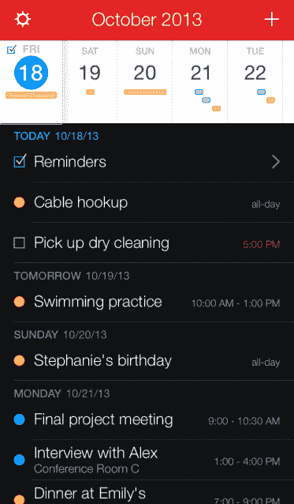
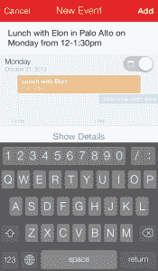
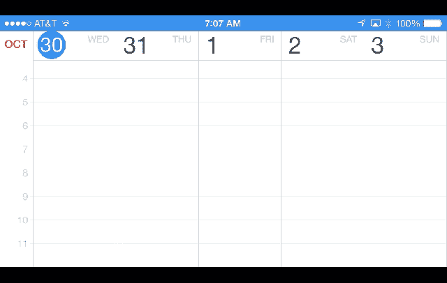
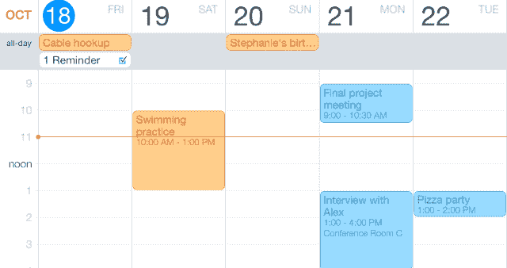

# fantastic 2 带来深度提醒支持，改进的 iOS 7 看起来是最好的 iPhone 日历 

> 原文：<https://web.archive.org/web/https://techcrunch.com/2013/10/30/fantastical-2-brings-deep-reminders-support-revamped-ios-7-look-to-the-best-iphone-calendar/>

作为我默认的日历替代应用，Fantastical 自近一年前发布以来一直在我 iPhone 的主屏幕上。作为我经常使用的少数几个生产力软件之一，我非常担心这个应用程序会随着 iOS 7 的更新而发生什么变化。

我不应该担心。[今天](https://web.archive.org/web/20221007034448/http://flexibits.com/fantastical-iphone)发布的《幻想曲 2》是抓住苹果 iOS 7 更新带来的机遇的最好例子之一，它不仅仅是视觉上的“换肤”。这是苹果付费排行榜上唯一一款[日历应用登上第一](https://web.archive.org/web/20221007034448/http://thenextweb.com/apple/2012/11/29/fantastical-eclipses-angry-birds-to-become-the-top-paid-app-in-apples-app-store/)宝座的恰当回归。

如果你对 Fantastical 不熟悉，它的优势是一个自然语言解析引擎，让你可以快速说出常规短语，如“周二中午在 Crab Shack 与 Joe 见面”,最终得到一个完整的输入日历条目，而无需键入任何数字。它聪明而强大，几乎总是按照你想要的方式工作。这与一个独特的布局相结合，在一个简单连续的约会议程上放置一个 1 周的“日历”或一个月历。

这是几周以来第二次，我们看到一个非常受欢迎的应用程序，它为 iOS 7 重新设计了独特的感觉，并取得了很好的效果。虽然可以说 [Tweetbot 拥有更明显的视觉语言](https://web.archive.org/web/20221007034448/https://beta.techcrunch.com/2013/10/24/tweetbot-3-makes-the-case-for-3rd-party-twitter-apps-with-bones-deep-ios-7-rewrite/)，但 Fantastical 对一些音符的打击相当大，这是不容易放弃的。

Flexibits 的 Michael Simmons 表示，在重新设计应用程序时所做的决定远远超出了如何让应用程序的视觉语言适应 iOS 7。是的，虚拟“日历”顶部的主要部分不见了，但也有更深层次的变化，这些变化真正改变了这款应用的实用性。

其中一个最大的例子就是位于 Fantastical“日报时”中心的商标“lens”。旧的设计深受“真正的”放大镜的影响，就是那种你可以在台历或日志上滑动来阅读某个条目的放大镜。新的设计保留了一些放大方面，但在视觉上进行了筛选，因此它不会再用它的聪明来打击你的眼球。但是设计的改变并没有就此停止。【T2

“我们把它移到了第一个位置，这样你就可以看到未来一周的情况，”西蒙斯说。他指出，这是为了让应用程序更好地工作而做出的艰难决定之一，而不是坚持最初建立的约定。在收报机中增加几天额外的背景是受欢迎的，也是一个好的选择。

还有一些其他功能，后台同步完全有效，确保当你打开应用程序时，约会和提醒就在你的指尖。为键盘快捷键添加了测试扩展器支持。它支持 Apple 对商品商标列表的动态文本大小调整。事件创建视图中的自定义键盘现在具有一行额外的数字键，用于当您想要快速输入时间或日期而不必交换键盘时。

现在也有一个美丽的扩展景观周视图，它在上下文中动画，给你一个更大的眼睛看你当前的一周。

最后，现在 Fantastical 中内置了广泛的提醒支持。

### 深度提醒支持

Simmons 说，对提醒的支持远远超出了在列表视图中添加对“待办事项”动作的支持。整个应用程序被重新设计，使提醒成为你日历中不可或缺的一部分。您不仅可以获得已完成和未完成提醒的颜色编码列表选项，还可以定制解析器，添加数千个触发词，让您自动添加项目作为提醒。

您会注意到，作曲家现在有一个开关，可以强制您正在创建的项目成为提醒，但只需键入一个触发短语也会创建一个提醒。“待办事项”、“提醒”、“提醒我”都会起作用，还有成百上千的其他功能。

当然，这一切都与苹果的提醒应用程序集成在一起。它都支持地理围栏，在到达或离开一个位置时触发。

有一个例子可以说明这些提醒是多么的周到:你不仅仅是得到一个清单，上面有你所有正在进行的，没有日期的项目。随着时间的推移，这将使显示器变得杂乱无章，变得毫无意义。只有您附加了日期或时间的项目才会显示在此处。这保持了列表作为你的“议程”的地位，只显示你必须及时完成的事情。

新的 iOS 7 后台通知支持意味着你现在也可以设置闹钟，使用像“闹钟”这样的关键字。以前，由于苹果对应用程序的限制性背景规则，只有当它们被同步到日历并且该应用程序发送了警报时，才会触发这些警报。现在，你可以在 Fantastical 中设置闹钟，并将它们同步到桌面版本并在后台触发。

### 讨价还价

最初的 Fantastical 最强大的一点——也是在新版本中保留的——是它确实是一个从头开始为我们如何使用手机而构建的日历。自 Sunrise 以来，已经有一些其他值得注意的条目[，但该应用程序简单的可滑动界面和强大的时间轴视图仍然使它脱颖而出。](https://web.archive.org/web/20221007034448/https://beta.techcrunch.com/2013/06/04/sunrise-raises-2-2-million-because-it-is-the-only-calendar-app-with-a-design-oriented-approach/)

《幻想曲 2》今天在[应用商店上架，作为付费升级版](https://web.archive.org/web/20221007034448/http://flexibits.com/fantastical-iphone)，价格为 2.99 美元，这符合我们看到的另一个趋势。在 iOS 7 更新上投入了大量工作的开发者对新版本的应用程序收费。Tweetbot 做到了这一点，并在应用商店排行榜上取得了巨大成功——同时收到了用户的大量反馈，他们认为这是一种抢钱行为。

就我而言，花几块钱买一个生产力应用，尤其是一个必不可少的、伟大的、不可思议的应用，是一个容易的选择。在接下来的几年里，我会打开这款应用数千次，并严重依赖它来确保我在需要的时候出现在需要的地方。经过一段时间的销售后，这款应用将会涨到 4.99 美元，仍然很便宜。