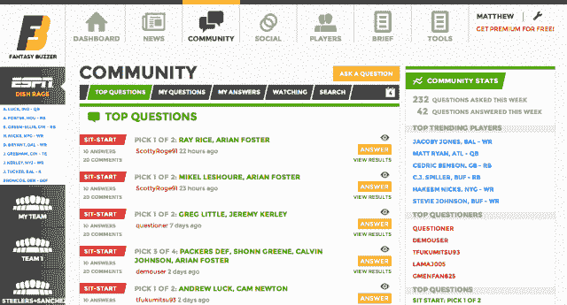

# 梦幻蜂鸣器作为梦幻足球研究的一站式商店推出 TechCrunch

> 原文：<https://web.archive.org/web/https://techcrunch.com/2013/08/01/fantasy-buzzer-launches-as-a-one-stop-shop-for-fantasy-football-research/>

随着梦幻橄榄球选秀赛季的开始，总部位于纽约的初创公司 [Fantasy Buzzer](https://web.archive.org/web/20221007094507/http://www.fantasybuzzer.com/launch) 推出了一个新网站，旨在为梦幻球迷提供实时新闻、伤病警报和为他们的球队量身定制的建议。因为没有什么比梦幻足球[更严肃的了。](https://web.archive.org/web/20221007094507/http://www.youtube.com/watch?v=qNcxFUHcgqk)

Fantasy Buzzer 在 2012 年 5 月的 TechCrunch Disrupt NY 黑客马拉松中赢得了 5000 美元的美国电话电报公司奖，旨在成为幻想研究的一站式商店。它聚集了关于用户球队的新闻和推文，为用户举办了类似 Quora 的论坛来互相投票征求意见，并提供了所有联盟球员的详细资料。

Fantasy Buzzer 的联合创始人兼首席执行官普里特什·达马尼说:“通常一个人每周会花 10 个小时做研究，去不同的网站，并找出下一个最适合他们做的事情。”“他们去 ESPN 和 NFL 看新闻。假设有一名球员受伤了，他们会就下一个该接谁的问题征求意见。”

Fantasy Buzzer 还会在游戏开始前发送由决策算法支持的文本和推送通知，以提醒用户是否犯了错误。达马尼说，这尤其适用于周日早上，因为粉丝们可能会在前一天晚上的派对后睡过头。

对用户的建议不仅仅是用另一个球员代替受伤的人，达马尼说这是一个很容易的建议。该网站还告诉用户何时应该指导一名不在自己球队的特定球员，以便日后利用他进行交易，并为挖墙脚名单创建排名。

梦幻足球应用的市场很大。2011 年，梦幻足球代表了至少 2700 万人，每年花费 8 亿英镑购买数字产品，而且这些数字还在增长。梦幻足球占 NFL.com 总流量的 75%。他说，人们对他们的球队进行大量投资，因为每个梦幻联盟都包括金钱赌注。

幻想蜂鸣器是利用幻想足球运动员的愿望，即使是最轻微的优势超过对方。该网站提供每季度 30 美元的高级升级，这使得这些用户可以优先使用该网站的所有功能。他们比其他人更早收到警报，他们的问题会被推到最前面。

达马尼说，Fantasy Buzzer 在 Payfone 的迈克·布罗迪(Mike Brody)领导的两部分种子轮中筹集了 38.5 万美元，很可能会再次筹集资金。

不过，这并不是第一家进入这一领域的初创公司。 [NumberFire](https://web.archive.org/web/20221007094507/http://www.numberfire.com/) 于 2010 年推出，类似的目标是[成为预测和新闻聚合的最终结果](https://web.archive.org/web/20221007094507/https://beta.techcrunch.com/2011/09/20/numberfire-raising-seed-round-to-build-the-last-fantasy-football-tool-youll-ever-need/)。他们也建立了一个类似于 Quora 模式的问题论坛。

随着许多论坛、博客和新闻网站致力于梦幻足球，梦幻蜂鸣器将不得不向用户证明其推送的推荐和建议的效用，这是目前突出的主要区分因素。