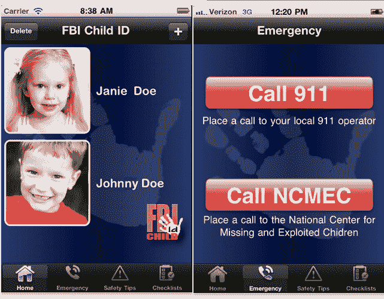

# FBI 推出其首个移动应用程序——名为“儿童 ID”的 iPhone 应用程序 

> 原文：<https://web.archive.org/web/https://techcrunch.com/2011/08/05/fbi-launches-its-first-mobile-application-the-child-id-iphone-app/>

# 美国联邦调查局推出其首个移动应用程序“儿童 ID”iPhone 应用程序

美国联邦调查局刚刚通知我们，它已经[推出了](https://web.archive.org/web/20221207212832/http://www.fbi.gov/news/stories/2011/august/child_080511/child_080511)它的第一个移动应用程序，一个名为[‘儿童 ID’](https://web.archive.org/web/20221207212832/http://itunes.apple.com/us/app/fbi-child-id/id446158585?ls=1&mt=8)(iTunes 链接)的 iPhone 应用程序。

这款应用为父母提供了一种电子存储孩子照片和重要信息的方式，使他们能够快速展示照片，并向附近的安全或警察提供身体识别信息，如身高和体重，如果孩子因任何原因失踪(根据美国联邦调查局的说法，在美国大约每 40 秒[就会发生一次](https://web.archive.org/web/20221207212832/http://www.fbi.gov/news/podcasts/inside/inside_071211.mp3/view))。

美国联邦调查局强调，在用户自己决定向当局发送任何东西之前，它不会收集或存储用户在应用程序中输入的任何照片或信息。

一个标签还允许父母迅速向相关部门发送电子邮件，该应用程序还提供了保护儿童安全的提示，以及在儿童失踪后关键的最初几个小时里应该做什么的具体指导。

显然，这款应用是免费的，美国联邦调查局表示，该应用将在“不久的将来”被移植到 iPhone 以外的手机上。

另请参阅:

美国联邦调查局增加了脸书、YouTube 和 Twitter 的个人资料。MySpace 彻底 Dissed

[联邦调查局在其社交媒体武库中增加了新的部件和脸书测验](https://web.archive.org/web/20221207212832/https://beta.techcrunch.com/2010/01/08/fbi-widgets-facebook-quiz/)

