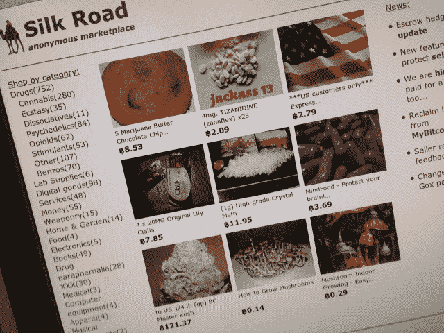

# 美国联邦调查局抓住深网黑市丝绸之路，逮捕业主

> 原文：<https://web.archive.org/web/https://techcrunch.com/2013/10/02/fbi-seize-deep-web-marketplace-silk-road-arrest-owner/>

联邦调查局已经赶上了丝绸之路。这个长期以来以贩毒和其他非法活动闻名的地下网站被联邦调查局查封，并以三项刑事罪名逮捕了网站所有者。根据一份法庭文件，纽约州检察官指控罗斯·威廉·乌布里切特犯有贩毒阴谋、电脑黑客阴谋和洗钱阴谋各一项。

* * *

**更新**:对法庭文件的进一步审查显示，在一名丝绸之路用户威胁透露用户信息后，乌布里切特请求谋杀。[更多信息请点击这里。](https://web.archive.org/web/20230402011148/https://techcrunch.com/2013/10/02/court-docs-reveal-alleged-silk-road-founders-murder-plot/?preview=true&preview_id=887372&preview_nonce=d75e25634a)

* * *

丝绸之路长期以来一直存在于互联网的角落，被称为深度网络，只能通过看似安全的 Tor 网络访问。该网站于 2011 年推出，很快因其阴暗的毒品和枪支市场而声名狼藉。丝绸之路成了非法物品的亚马逊。截至 2013 年 7 月 23 日，大约有 957，079 个注册用户账户，正如法院文件所指出的，这不一定等于实际用户的数量。

尽管名不见经传，丝绸之路还是赚了大钱。法庭文件显示，从推出到 2013 年 7 月 23 日，总收入约为 9519664 比特币，丝绸之路本身的佣金为 614305 比特币。按照目前的比特币价格，这相当于约 12 亿美元的收入和 7980 万美元的佣金。

丝绸之路的竞争对手，[亚特兰蒂斯](https://web.archive.org/web/20230402011148/https://techcrunch.com/tag/atlantis)，旨在为同样的市场增加一点奇思妙想和 Web 2.0 营销的活力。它上个月关闭了。

正如法庭文件所指出的，丝绸之路的所有者罗斯·威廉·乌布里切特故意并故意违反了美国禁毒法。此处提供的文档[内容如下:](https://web.archive.org/web/20230402011148/http://t.co/nLQVlBNYVS)

> 从 2011 年左右到 2013 年 9 月左右，被告 ROSS WILLIAM ULBRICHT，又名“恐惧海盗 Roberts”，又名“DPR”，又名“丝绸之路”，拥有并经营一个名为“丝绸之路”的地下网站，为世界各地的毒贩提供一个平台，通过互联网销售各种受管制物质。

但这只是乌布里切特麻烦的开始。他还被指控参与黑客阴谋和洗钱。该网站目前已关闭，被联邦调查局查封。然而，看看政府如何处理这个庞大的组织应该很有趣。丝绸之路上的绝大多数互动都是匿名的，在各方之间使用比特币转账进行，并建立在安全的电子邮件交换中。

根据法庭文件，执法人员通过丝绸之路进行了 100 多次个人秘密购买，获得了附表一和附表二药物，包括摇头丸、可卡因、海洛因、迷幻药等。

据报道，Ulbricht 于 2013 年 10 月 1 日在旧金山格伦公园图书馆被捕。

* * *

## 增加承保范围