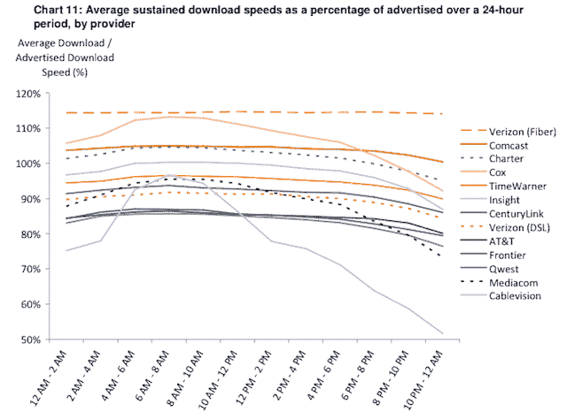

# FCC 分析揭示 ISP 速度的赢家和输家 

> 原文：<https://web.archive.org/web/http://techcrunch.com/2011/08/02/fcc-analysis-reveals-isp-speed-winners-and-losers/>

比方说，你走进百思买寻找一款新平板电脑。你走向那个穿蓝色马球衫的人，告诉他你在找什么。把你带到平板电脑区后，他掏出手帕蒙住你的眼睛。“都是真的好！”他承诺。“左边的是 499 美元，中间的是 549 美元，右边的是 600 美元。今天我能为你打包哪一个？”

这听起来很荒谬，但本质上这就是你一直在为互联网服务提供商购物的方式:像蝙蝠一样盲目，除非你想相信他们的广告。但是现在，有史以来第一次，美国联邦通信委员会在一个月的时间里收集了 9000 名普通美国人的数据。目标是:衡量真实世界中 ISP 提供的速度，而不仅仅是他们广告中的速度。

【T2

完全没有必要进入这份报告的所有数学计算。相反，我将告诉你一些关键的要点，这样我们都可以成为更聪明的购物者。请注意，这不包括其他统计数据，如正常运行时间、客户服务、成本等。它实际上更关注 ISP 的实际速度与广告速度之间的差异——这显然是有价值的数据。

首先，Cablevision 的用户数量似乎超出了它的处理能力。该公司在所有 ISP 中得分最低，差距很大。在 24 小时内，CableVision 的平均下载速度不到广告速度的 80%。在高峰时段，ISP 几乎没有超过其承诺速度的 50%。美国电话电报公司、MediaCom、Qwest 和 Frontier 也很难达到承诺的速度，尽管没有一家像 CableVision 那样纳税。

令人高兴的是，威瑞森的顾客应该为自己感到骄傲。你做出了明智的选择。Fios 的平均真实速度实际上高于广告宣传的速度，无论是在 24 小时内还是在冲浪高峰期——因为这是一项新服务，很难说它是否会保持这种速度，但这些数字很难反驳。其他排名靠前的互联网服务提供商包括 Comcast 和 Cox。

这是整个报告中最好的消息:报告存在。在此之前，很难区分谎言和真相。现在一切都为你规划好了，漂亮又整洁。不要害怕为你所付出的去奋斗。如果你的 ISP 提供的速度总是比他们承诺的慢，做一点测试，记下来，然后投诉。永远不要忘记:顾客永远是对的。

[scribd id = 61477378 key = key-23 bw 4 hhvuknjivcjj 6 fr mode = list]