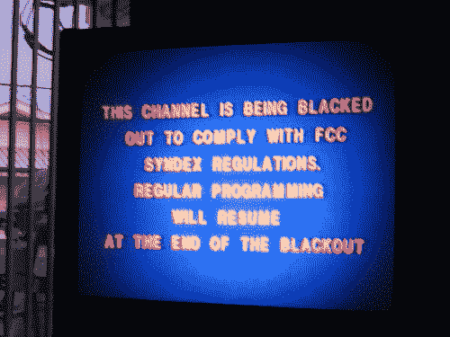

# FCC 网络中立投票只是开始 TechCrunch

> 原文：<https://web.archive.org/web/https://techcrunch.com/2010/12/21/fcc-net-neutrality-vote-is-just-the-beginning/>

# FCC 网络中立投票仅仅是个开始

   图片 2005 [ dougward ](https://web.archive.org/web/20230204121254/http://www.flickr.com/people/48600093035@N01 "click to visit the Flickr profile page for dougward") | [更多信息](https://web.archive.org/web/20230204121254/http://www.flickr.com/photos/48600093035@N01/21730798 "get more information about the photo 'FCC Blackout'")**(via:[Wylio](https://web.archive.org/web/20230204121254/http://wylio.com/ "free pictures"))**在一场 3-2 的投票中分裂出党派界限 [FCC 今天早上批准了第一个“可执行的”网络中立条例](https://web.archive.org/web/20230204121254/http://mediadecoder.blogs.nytimes.com/2010/12/21/f-c-c-approves-net-rules-and-braces-for-fight/)。这些规则面临着来自各方面的反对，一些人认为 FCC 超越了它的界限，另一些人则认为尚未公布的框架没有提供足够的保护。

*“鉴于开放的互联网对我们经济未来的重要性……联邦通信委员会有必要履行其作为巡逻警察的历史职责，以确保我们通信网络的活力，并增强和保护这些网络的消费者，”联邦通信委员会委员 Julian Genachowski 在会议上说。*

FCC 作为互联网交通警察的想法并不为许多人所接受。投票反对这些规定的联邦通信委员会委员罗伯特·麦克道尔[强调了](https://web.archive.org/web/20230204121254/http://www.betanews.com/article/For-better-or-worse-here-are-the-FCCs-new-Net-Neutrality-rules/1292957304?awesm=betane.ws_sy&utm_content=api&utm_medium=betane.ws-twitter&utm_source=direct-betane.ws)关于 Genachowski 的提议的分歧*“我们同意互联网应该保持开放和自由……除此之外，我们不同意。我们的观点之间的反差再明显不过了。”*

今天的投票结果还没有公布，但是据报道，它为固定宽带和移动宽带流量设计了两个不同的框架。在这两种情况下，康卡斯特或威瑞森等运营商都需要向客户提供透明度，并被禁止屏蔽谷歌语音或 Skype 等竞争服务。

这两种不同服务的处理方式与“合理的网络管理实践”的精确含义之间的差异是反对派愤怒的原因。最初的监管报告称，它们明确禁止提供商在宽带方面接受不合理的流量优先支付，而在移动宽带方面没有提供这种保护。

如果说今天的投票有什么成功的话，那就是引发了关于联邦通信委员会是否拥有监管互联网行为的最终权力的[辩论。共和党人已经开始](https://web.archive.org/web/20230204121254/http://mediadecoder.blogs.nytimes.com/2010/12/21/f-c-c-approves-net-rules-and-braces-for-fight/)[制造噪音](https://web.archive.org/web/20230204121254/http://www.msnbc.msn.com/id/40768809)反对在一月份共和党人占多数的国会接管时阻止这些法规。麦克道尔还暗示了来自法院的潜在阻碍:“联邦通信委员会挑衅性地特许了与立法部门的冲突路线。”

这并非没有先例:联邦上诉法院在 4 月份做出了不利于 FCC 的裁决，取消了 FCC 的权力，因为它试图对 Comcast 歧视文件共享实施网络中立原则。

威瑞森对今天投票的官方反应也强调了这样一个事实，即联邦通信委员会正在进行一场斗争。这种没有坚实的法律基础的权威主张将给行业、创新者和投资者带来持续的不确定性。从长远来看，这对消费者和国家都是有害的。”