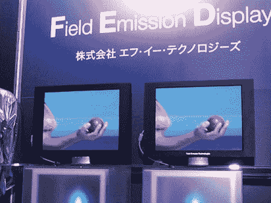

# 美联储:索尼退出，基本上埋葬了整个技术 TechCrunch

> 原文：<https://web.archive.org/web/https://techcrunch.com/2009/03/31/fed-sony-calls-it-quits-basically-burying-the-technology-as-a-whole/>

# 美联储:索尼叫停，基本上把技术整体埋没了

看来 [FED(场发射显示器)](https://web.archive.org/web/20230126222451/http://en.wikipedia.org/wiki/Field_emission_display)技术不会成为 LCD 和等离子的接班人。东芝早在 2007 年 1 月就分别放弃了美联储和 T4。该公司停止了与佳能的合资企业，佳能似乎也或多或少地停止了该领域的开发(至少在过去几个月里，佳能没有发布与美联储或 SED 相关的消息)。

现在美联储也拿索尼开刀了。

索尼去年夏天表示，它希望从日本先锋公司收购一家等离子电视工厂。该工厂本应重建为 FED 显示器工厂，但索尼现在放弃了这一计划。此外，该公司将关闭 [FED Inc.](https://web.archive.org/web/20230126222451/http://www.fe-tech.co.jp/en/index.html) ，这是一家完全专注于 FED 生产的分拆实体。FED Inc .以 2600 万美元成立于 2006 年末。

索尼早在 1998 年就开始试验 FED 技术，并在 2001 年展示了一款 13 英寸的原型电视。但是即使索尼在去年 7 月表示计划增加 FED 的产量，FED 也从未商业化。而且现在很难说还有其他公司敢批量生产大尺寸的 FED 显示器。