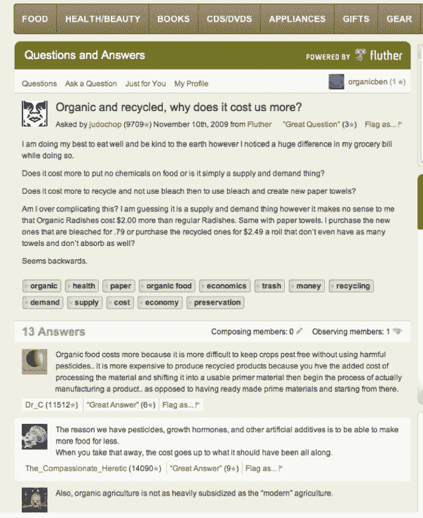

# Federated Fluther 允许第三方用几行代码集成问答 

> 原文：<https://web.archive.org/web/https://techcrunch.com/2010/08/09/federated-fluther-lets-third-parties-integrate-qa-with-a-few-lines-of-code/>

# Federated Fluther 允许第三方用几行代码集成问答

最近，  Q & A 服务引起了相当多的关注，首先是热门初创公司 [Quora](https://web.archive.org/web/20221207102513/http://www.quora.com/) ，最近是脸书问题的[发布](https://web.archive.org/web/20221207102513/https://beta.techcrunch.com/2010/07/28/facebook-qa-service-questions-begins-rolling-out-could-be-massive/)。现在，早在 2007 年创立的 Q 公司正在寻求帮助更多的网站利用这一趋势。今天，该公司推出了 [Federated Fluther](https://web.archive.org/web/20221207102513/http://www.fluther.com/federated/) ，这是一种分布式服务，允许第三方提供相对少量的工作。

Federated Fluther 通过整合整合了它的第三方网站上的问题来工作——这个过程涉及添加几行代码，并与网站现有的认证系统一起工作。在一个 Fluther Federated-enabled 网站上问一个关于汽车的问题，Fluther 可以将这个问题发送给正在浏览汽车网站的用户(他们的回答随后会被转发回问题的来源)。与 Fluther 的原始产品一样，问题和答案是实时分发的，首席执行官本·芬克尔说，这项服务上 98%的问题都得到了回答，其中大多数都在几分钟内得到了回答。

那么为什么第三方要嵌入这个呢？一个很大的原因是流量——问答在搜索引擎上通常做得很好。Fluther 已经优化了这项服务，这样它的第三方合作伙伴就可以在他们的网站上获得这些问题和答案的 SEO 好处。这些内容也将出现在 Fluther 的主要门户网站 Fluther.com 上，但 Fluther 不会将其暴露给搜索引擎，以免与其合作伙伴竞争。芬克尔表示，第三方也会受益，因为问答会非常吸引人(从而让用户更长时间地回到他们的网站)，还因为浏览 Fluther.com 的用户也会被介绍到这些第三方网站。

显然，Federated Fluther 将面临来自老牌问答服务的相当大的竞争，脸书有可能在未来某个时候提供一个支持连接的问题版本。联合模式的好处还需要一段时间才能显现出来，因为该服务在拥有众多第三方网站之前，无法针对专家社区提出问题。也就是说，Fluther 仍然可以将问题反馈给 Fluther.com 的核心用户群，因此它在大多数情况下都能够返回答案。

Fluther 去年从一些著名的天使那里筹集了 60 万美元，其中包括罗恩·康韦、纳瓦·拉维坎特、马克·安德森、本·霍洛维茨和戴夫·麦克卢尔，伦纳德·斯佩瑟和比兹·斯通担任顾问。

