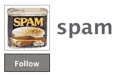

# 通过直接向 Twitter 发送消息来抵制垃圾邮件 

> 原文：<https://web.archive.org/web/http://techcrunch.com/2008/10/06/fight-spam-with-a-direct-message-to-twitter/>

# 通过直接向 Twitter 发送消息来打击垃圾邮件

似乎还没有官方声明，但 Twitter 已经开始通过直接消息向“垃圾邮件”用户帐户征集垃圾邮件报告。

你是 Twitter 垃圾邮件的受害者吗？只要开始关注 [@spam](https://web.archive.org/web/20230203003657/http://twitter.com/spam) 并直接发送带有垃圾邮件发送者用户名的信息。正如以下垃圾邮件举报人自动回复邮件所述，你可以用手机直接发送这些信息，也可以选择公开发布推文:

> 你好。
> 
> 感谢您举报垃圾邮件，我们正在努力消除垃圾邮件！你知道吗:你现在可以很容易地直接从你的 Twitter 账户举报垃圾邮件了。请访问:
> 
> 然后跟着账号走。然后，您可以发送:
> 
> *直接发给@spam 的消息:@moneybagsnow 是垃圾邮件发送者！
> *一条来自你手机使用 d+用户名+消息的直接消息:d spam @carmoney，@cashnow 是垃圾邮件！
> *对@spam 这样的回复:@spam 这是一个垃圾账号:@bigmoney5
> 
> 我们会处理好的。您可以发送尽可能多的垃圾邮件用户名，只要它们被指定为@crystal。
> 
> 注意:最好通过@回复直接发送消息。直接消息让@replies 在您的关注者的时间线之外报告垃圾邮件。发送直接邮件还会将垃圾邮件帐户的用户名排除在所有搜索结果之外。因为信息是私人的，你阻止他们从公开中获益。再次感谢您帮助我们追踪垃圾邮件发送者！
> 
> Twitter 支持团队

到目前为止，已经有 213 名成员开始关注@spam，奇怪的是，它自己也决定关注 179 名成员。它必须获得更多的追随者，才能在 Twitter 的垃圾邮件问题上有所作为。截至 7 月 12 日， [Twitter 黑名单](https://web.archive.org/web/20230203003657/http://twitterblacklist.com/)，一个在其所有者[对该服务失去信心](https://web.archive.org/web/20230203003657/http://twitterblacklist.com/closed.html)之前[跟踪](https://web.archive.org/web/20230203003657/http://techcrunch.com/2008/05/07/twitter-starts-blacklisting-spammers/)所有被禁 Twitter 账户的网站，列出了 561 个黑名单用户。

点击这里阅读更多关于 Twitter 反垃圾邮件努力的信息[。](https://web.archive.org/web/20230203003657/http://blog.twitter.com/search?q=%40spam)

[谢谢你的提示，拉法]