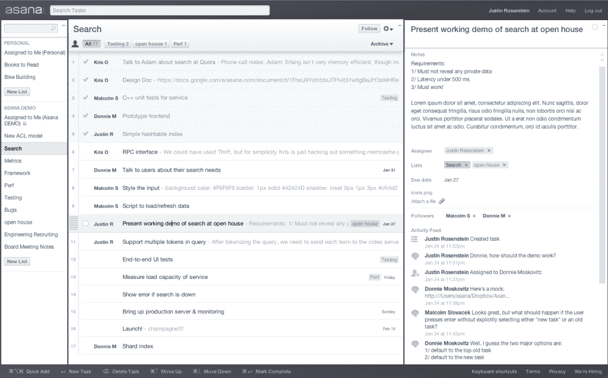

# 最后:脸书联合创始人为两岁的 Asana TechCrunch 揭开帷幕

> 原文：<https://web.archive.org/web/https://techcrunch.com/2011/02/07/finally-facebook-co-founder-opens-the-curtain-on-two-year-old-asana/>

两年前，当达斯汀·莫斯科维茨宣布他将离开脸书，与他的 Facebook 同伴贾斯汀·罗森斯坦一起创办一家新公司时，大多数人会想到两件事:他和马克·扎克伯格闹翻了，或者他疯了。还有什么比脸书更令人兴奋的呢？

当然，莫斯科维茨是扎克伯格的大学室友，也是脸书的联合创始人。如果你从阿伦·索尔金那里了解脸书的历史，他就是那个在沉默中编码的家伙，而半裸的女孩们则在《T4》中大显身手。如果你从*真实发生的事情*中了解脸书的历史，莫斯科维茨比其他任何一位联合创始人都活得长，并在公司早期轻松地扮演了最关键的角色之一。因此，Asana 将比大多数商业软件创业公司获得更多的关注和审查，甚至可能是炒作。

但事实是:Asana 值得拥有它。事实证明，莫斯科维茨决定离开的两个假设都不正确。莫斯科维茨和罗森斯坦刚刚有了一个非常伟大的想法:解决人们如何在项目中合作和在团队中工作。尽管花费了数十亿美元来开发一个实现协作和通信的软件，但是到目前为止还没有解决这个问题。这种东西可能深深植根于人类行为的特质中，以至于无法修复。

但是 Asana 的开场令人印象深刻。在下面的视频中有一个软件的完整演示，来自 Asana 最近的朋友和家人的开放日，所以我不会在这里长篇大论。(截图如下。)亲自聆听创始人的演讲。该公司仍处于私人测试阶段，有 1200 家公司在等待获得邀请。今年将会开放更多。Asana 已经从几个天使投资者、Benchmark Capital 和 Andreessen Horowitz 那里筹集了 1000 多万美元。

对我来说，Asana 是最令人兴奋的脱离早期“脸书黑手党”的公司——尽管 Quora 的大肆宣传和谷歌令人瞠目结舌的 1.2 亿美元收购 Path 的报价。话又说回来，我算是一个商业软件呆子。我一直在等待这个“新一代”的企业软件公司，每个人都在谈论它，大多数人都觉得开源和软件即服务一代令人失望。这些公司改变了软件定价、交付和实现的方式，颠覆了老牌巨头，这可不是一个小壮举。但就产品而言，这些类别的重新发明并不像销售导向的首席执行官让你相信的那样引人注目。Yammer 无疑比大多数人更接近于实现那个时髦的短语“企业的消费化”，但它主要是通过将适用于 Twitter 的东西应用到一个工作安全、安全的应用程序。

但是 Asana 与其他协作软件有着显著的不同。部分原因在于时机。Benchmark 的马特·科勒(Matt Cohler)表示:“我认为，网络技术已经发展到了这样一个地步，你可以在浏览器中获得非常棒的体验，比你在桌面应用程序中获得的体验更好。”。“Asana 团队花了相当多的时间投资于底层框架和技术，以利用几年前无法实现的优势。”部分原因是因为 Asana 是 20 多岁的年轻人从根本上重新考虑的第一批商业软件产品之一，他们没有旧式企业销售的背景，坦率地说，也没有太多在工作场所使用企业软件的经验。

但是在我观看它的时候，有一点让我印象深刻:你可以看出 Asana 是由脸书的创始人之一共同创造的。这是一个近乎狂妄的使命:修复人们的合作方式，让全球工作场所变得更好、更高效、更少挫折。莫斯科维茨说:“离开脸书的前提条件是，我不会去做仅仅是追逐金钱的事情。”。有那种脸书式的对效率的痴迷，用新闻、更新和干净的设计来组织本质上混乱的社交事物。实用主义和数据驱动的决策主导着公司。节俭很重要，但不是一切。Asana 的工程师——公司的神——得到 1 万美元的预算来清理他们的办公桌。莫斯科维茨耸了耸肩，说他认为应该更多，但想不出他们需要的任何价格超过 1 万美元的东西。

就像脸书早期痴迷于成为“实用工具”一样，Asana 希望人们在整个工作日都生活在这个应用程序中。就像脸书抛弃了 MySpace 世界的杂乱和不必要的页面点击一样，Asana 也痴迷于速度。他们知道，如果软件用起来一点都不方便，员工就不会使用它。像脸书一样，Asana 认为它的最终客户群是每个人。他们希望人们不要只是在工作中使用体式，而是在婚礼策划中使用。这两个人想要开发这个产品，因为在脸书管理团队是一件如此乏味的事情。从某种意义上说，莫斯科维茨说他仍在为脸书工作，因为他仍在试图解决他在那里试图解决的问题。碰巧的是，他也在努力为世界上的每一家公司解决这个问题。

但尽管如此，这绝不是另一个“企业的脸书”没有朋友列表，没有活动，没有照片分享。体式不是让工作场所变得“有趣”或者为了社交而社交。这不是关于组织你的社交图谱。它是关于帮助人们更有效地一起工作——切断对电子邮件的依赖，减少对那些无休止的会议的需求，在一个时刻轻松分配和跟踪任务，因为不像那些蹩脚的企业维基，人们生活在应用程序中。莫斯科维茨和罗森斯坦很清楚:如果他们做不到这一点，他们就失败了。  