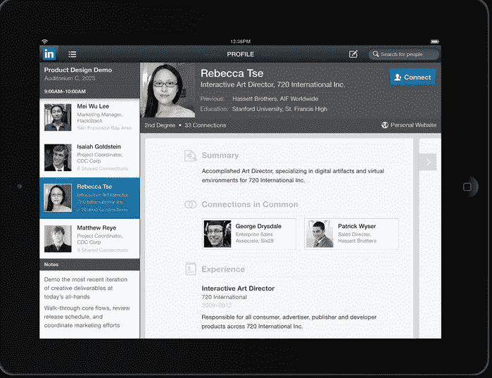

# 最后，职业社交网络 LinkedIn 为用户提供了一款 iPad 应用 

> 原文：<https://web.archive.org/web/https://techcrunch.com/2012/04/25/finally-professional-social-network-linkedin-gives-users-an-ipad-app/>

# 最后，职业社交网络 LinkedIn 给用户提供了一个 iPad 应用程序

尽管 iPad 已经上市两年多了，LinkedIn 还没有为其用户提供一款原生应用，尽管该网络的移动参与度一直在快速增长。但去年 8 月，LinkedIn 首席执行官杰夫·韦纳(Jeff Weiner)表示，该公司正在加倍实施其移动战略。该网络随后推出了新版本的 iPhone 和 Android 应用程序以及 HTML5 移动网站[。事实上，LinkedIn 现在表示，其 22%的活跃会员一直在移动设备上访问。今天，LinkedIn 终于向公众推出了它的原生 iPad 应用程序。](https://web.archive.org/web/20221220065146/https://techcrunch.com/2011/08/16/linkedin-redesigns-android-iphone-apps-with-groups-and-more-debuts-html5-mobile-site/)

正如 LinkedIn 移动产品负责人 Joff Redfern 解释的那样，该应用程序是在考虑用户和平板电脑界面的情况下开发的。由于 iPad 已经成为一种向后倾斜的体验，LinkedIn 希望确保该应用程序满足 iPad 用户的需求。通过网络，LinkedIn 注意到 iPad 用户大多在早上访问该网站，他们称之为“咖啡时间”，晚上则在晚上 7 点到 11 点之间。有了这些数据，该公司希望构建一个应用程序，让专业人士能够通过 LinkedIn 开始一天的工作，并结束一天的工作。

通过更新部分，用户可以从您的连接中访问一系列更新，包括谁换了工作以及谁查看了您的个人资料。您还可以访问 connections 正在共享的新闻，并查看您所属的组的最新讨论。

除了活动流，您还可以访问自己的个人资料、联系和活动仪表板，并从网络中的收件箱发送和接收 LinkedIn 邀请和消息。

iPad 应用程序中更引人注目的功能之一是能够将设备的日历与你的 LinkedIn 个人资料信息同步。因此，你可以安排一天的会议，并从 LinkedIn 个人资料中找到联系人的背景信息。LinkedIn 的 iPhone 和 Android 应用程序的最新升级也提供了这一功能。正如 Redfern 解释的那样，许多移动设备上的用户在会议开始前进行了最多的联系人搜索，因此添加该功能是有意义的。LinkedIn 也推出了一个 iPad 友好的移动网站，可以通过访问 touch.linkedin.com 来访问。

虽然该应用程序目前只有英文版本，但 LinkedIn 将很快推出其他语言版本。

尽管 LinkedIn 为其用户提供了 iOS 和黑莓应用程序，但这个职业社交网络花了几年时间才[推出一款原生安卓应用程序](https://web.archive.org/web/20221220065146/https://techcrunch.com/2010/12/16/linkedin-android/)，因此该公司花了一段时间开发 iPad 应用程序也就不足为奇了。雷德费恩解释说，LinkedIn 有三名专门的工程师在开发这个应用程序。至于下一步，雷德费恩表示，LinkedIn 将监测开发 Android 平板电脑应用程序的意义。

TechCrunch 电视台记者科琳·泰勒(Colleen Taylor)与雷德费恩(Redfern)坐下来演示了这款应用，并讨论了新功能。下面看。

科琳·泰勒对本文有贡献。