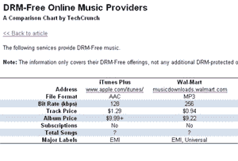
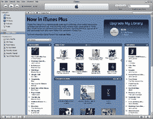
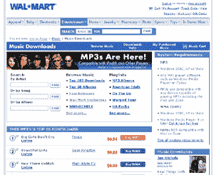
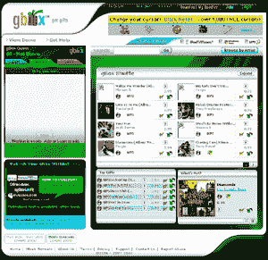
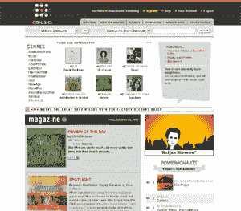
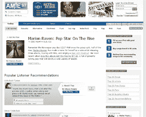

# 在线查找无数字版权管理的音乐 

> 原文：<https://web.archive.org/web/http://www.techcrunch.com:80/2007/08/24/finding-drm-free-music-online/>

在过去的半年里，我们见证了自苹果 2003 年推出 iTunes 商店以来在线音乐行业最重大的变化。继史蒂夫·乔布斯在二月发表公开信澄清苹果在数字版权管理(DRM)上的立场后，主要唱片公司已经开始在网上免费提供他们的音乐，没有盗版保护机制。

第一个冒险尝试的主要唱片公司是[百代音乐](https://web.archive.org/web/20221006011900/http://www.emigroup.com/)，该公司在 5 月份与苹果公司合作，通过苹果音乐商店的一个名为 iTunes Plus 的无数字版权管理区域发布其整个在线目录。同样在 5 月，[亚马逊宣布](https://web.archive.org/web/20221006011900/http://www.beta.techcrunch.com/2007/05/16/another-break-in-the-wall-amazoncom-to-sell-drm-free-music/)将在今年年底推出一个只有 MP3 的在线音乐商店，出售主要唱片公司的歌曲。

就在本周，沃尔玛[开始通过其网站销售](https://web.archive.org/web/20221006011900/http://news.zdnet.com/2100-9588_22-6203574.html)许多[环球音乐集团](https://web.archive.org/web/20221006011900/http://www.umusic.com/)和 EMI 歌曲的无保护 MP3。RealNetworks、MTV 和威瑞森还联手[推出 Rhapsody America，这是一项迎合手机用户的音乐服务，将在不久的将来提供无 DRM 下载。甚至一家 P2P 软件制造商 LimeWare 最近也宣布它计划成为无 DRM 运动的一部分(这次是合法的)。](https://web.archive.org/web/20221006011900/http://www.engadget.com/2007/08/21/mtv-real-to-merge-urge-and-rhapsody/)

一些主要的音乐公司比其他公司更为谨慎。百代通过解锁其所有在线音乐，在无数字版权管理运动中投入了最大的力量。虽然环球公司已经同意通过几家在线零售商——real networks、谷歌、百思买、沃尔玛、亚马逊和 gBox(——发布数千张未受保护的专辑和歌曲，但它只是在试验的基础上这样做，这将只延续到 2008 年 1 月，届时该公司将决定它认为无 DRM 保护的音乐是促进还是损害销售。[索尼 BMG 音乐娱乐](https://web.archive.org/web/20221006011900/http://www.bmg.com/)和[华纳音乐集团](https://web.archive.org/web/20221006011900/http://www.wmg.com/)仍然站在无数字版权管理运动的边缘，似乎在等着看百代唱片公司和环球唱片公司如何通过开放来获利。

虽然事情的进展表明，所有的在线音乐最终都将免于 DRM，但没有必要等着加入免 DRM 行动。查看下面的无 DRM 的在线音乐零售商，获得几乎可以在任何手持音乐设备、任何计算机和任何音乐程序上播放的质量更好的音乐。所涉及的零售商提供主要和次要品牌的音乐。

更新:real networks 的一名代表通知我们，“目前没有计划在 Rhapsody America 推出时对 Rhapsody 的店面进行重大改造”，也没有计划增加可供销售的无 DRM 的歌曲数量。只有环球音乐集团决定推出更多专辑，这个数字才会改变。”所以不要坚持 Rhapsody America，因为显然这项服务的无 DRM 版本将与当前版本的 Rhapsody 相同。

**iTunes Plus**

苹果是 800 磅重的大猩猩，控制着大约 70%到 80%的在线音乐零售市场。首席执行官史蒂夫·乔布斯[在五月](https://web.archive.org/web/20221006011900/http://news.zdnet.com/2100-9588_22-6187457.html)预测到今年年底，通过 iTunes 商店[提供的超过一半的歌曲将是无数字版权管理的。](https://web.archive.org/web/20221006011900/http://www.apple.com/itunes/)

虽然我们大多数人都熟悉 iTunes Store，但你可能没有注意到该商店主页上“快速链接”下的 iTunes Plus 子商店的链接。iTunes Plus 提供 256kbps 无 DRM 的 AAC 文件，每首歌曲 1.29 美元，每张专辑 9.99 美元以上。这比通过 iTunes 商店销售的受 DRM 保护的歌曲每首高出 30 美分。

已经从苹果公司购买了大量音乐？您可以以每首歌曲 30 美分、每张专辑当前专辑价格的 30%和每段音乐视频 60 美分的价格将您受 DRM 保护的收藏升级到无 DRM 保护的收藏。当然，您只能升级那些通过 iTunes Plus 提供的歌曲和视频。

iTunes Plus 上提供的艺术家包括酷玩乐队、滚石乐队、弗兰克·辛纳屈、街头霸王乐队和野兽男孩。

**沃尔玛**

沃尔玛也许没有苹果性感，但这个零售巨头确实提供来自环球和百代的无数字版权管理的音乐。周二，沃尔玛开始提供其大部分音乐的 256kbps MP3 版本，每首 94 美分或每张专辑 9.22 美元。这些无数字版权管理的产品是对沃尔玛之前 128kbps 受数字版权管理保护的 WMA 文件的补充，每首歌 88 美分或每张专辑 9.44 美元。

沃尔玛网上商店的一大缺点是:你只能用 Windows 系统的机器下载音乐。仅这一限制就将使沃尔玛很难与苹果争夺市场份额。

艺术家包括艾米·怀恩豪斯、魔力红、平克·弗洛伊德、耐莉和邦·乔维。

**gBox**

感觉大方？我们最近在[报道过的](https://web.archive.org/web/20221006011900/http://www.beta.techcrunch.com/2007/08/21/gbox-give-the-gift-of-drm-free-music/)gBox，让你不仅可以为自己，也可以为他人购买无数字版权管理的音乐。gBox 用户可以创建音乐愿望列表，这些列表可以嵌入到其他网站中，供朋友、家人和爱好者用来为列表创建者购买音乐。

环球是同意通过 gBox 销售无数字版权管理音乐的主要唱片公司之一。歌曲每首 99 美分，专辑每张 9.99 美元。

不幸的是，和沃尔玛一样，想从 gBox 下载的 Mac 用户运气不佳。这将对 gBox 允许意愿列表嵌入社交网络的高度病毒式商业策略产生负面影响。

eMusic

你可能没听说过 eMusic，但这项服务拥有超过 250 万首歌曲，在在线音乐销售方面仅次于 iTunes。eMusic 成立于 1998 年，是第一家销售 MP3 的公司，它继续以订阅而不是按单元收费的方式销售。

订阅有两种方式:每月 9.99 美元，每月最多下载 30 次；每月 19.99 美元，每月最多下载 75 次。他们的订阅最酷的一点是:一旦终止，你仍然可以保留你的音乐，不像 Napster 等其他订阅服务。新用户还可以免费获得 25 首歌曲。

虽然 eMusic 有销售无 DRM 的音乐的悠久传统，但他们仍然没有参与任何重大的唱片公司行动。你在这里找不到环球、百代、索尼 BMG 或华纳的任何音乐。但是如果你无论如何都不喜欢流行音乐，eMusic 对你来说可能是完美的。

**有声便当盒**

如果你喜欢 eMusic，你可能也会喜欢[音频午餐盒](https://web.archive.org/web/20221006011900/http://www.audiolunchbox.com/)。该公司的 200 多万首歌曲是无数字版权管理的，完全独立。

客户可以选择以订阅或按单元付费的方式购买音乐。

订阅费用从每月 9.99 美元到每年 250 美元不等。按单价计算，歌曲每首 99 美分，专辑每张 9.99 美元。

所有下载都是 192kbps 的 VBR MP3 文件。

 **

[AmieStreet](https://web.archive.org/web/20221006011900/http://www.crunchbase.com/company/AmieStreet) ，我们已经报道[多次](https://web.archive.org/web/20221006011900/http://www.beta.techcrunch.com/2007/07/03/amie-street-celebrates-first-birthday-free-music-for-techcrunch-readers/)，像 eMusic 和 Audio Lunchbox 提供没有主要厂牌合同的艺术家的无数字版权管理的歌曲(尽管，AmieStreet 已经[与 Nettwerk Productions](https://web.archive.org/web/20221006011900/http://www.beta.techcrunch.com/2007/03/05/barenaked-ladies-new-album-free-no-drm-now/)合作，提供像 Barenaked Ladies 和莎拉·麦克拉克兰这样的大牌的音乐)。

AmieStreet 最有趣的是它的定价方案。单首曲目的价格在 0 到 98 美分之间。网站上提供的音乐一开始是免费的，但随着越来越多的人下载，价格会上涨。因此，价格以类似于拍卖的精神反映了轨道的实际受欢迎程度。

AmieStreet 上出售的歌曲总是 MP3 格式，但比特率会随着艺术家直接向网站贡献歌曲而变化。**