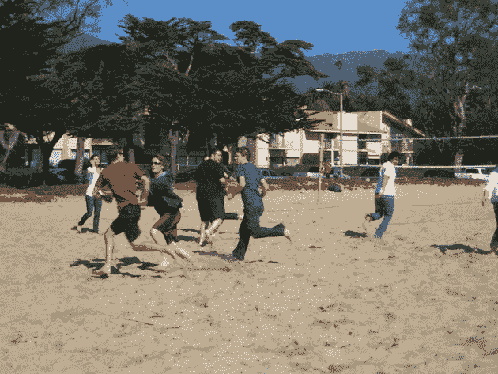

# FindTheBest 看起来像是赢家 TechCrunch

> 原文：<https://web.archive.org/web/http://techcrunch.com/2011/02/03/findthebest-looks-like-a-winner/>

大多数初创公司在推出后的头几个月里都不会保持流量不变(例如，Twitter 用了一年多时间)。所以当他们这么做的时候，要么是发生了非常特别的事情，要么是非常鬼鬼祟祟的事情。

由 DoubleClick 联合创始人[凯文·奥康纳](https://web.archive.org/web/20230203001549/http://www.crunchbase.com/person/kevin-oconnor)创立的比较引擎 find the best 无疑正在风起云涌。他们于去年年底启动了项目，并于去年 12 月获得了凯鹏华盈投资公司的资助，并且像野草一样悄然成长。该公司表示，他们现在每月有 100 万独立访客，像 Compete [这样的服务显示了](https://web.archive.org/web/20230203001549/http://siteanalytics.compete.com/findthebest.com/)一个明确的，如果早的话，曲棍球棒(不管实际数字，Compete 总是关闭，但轨迹说明了一些事情)。

公司有没有买流量？不，奥康纳说。这都是有机增长，正如预期的那样，大量搜索引擎推荐进来。这还不是一个巨大的流量，但它的趋势很好，似乎并不仅仅是基于媒体的高峰(自 12 月以来没有任何真正的)。

为什么？

FindTheBest 是一个非常好的数据搜索和比较引擎。如果你想比较像[滑雪场](https://web.archive.org/web/20230203001549/http://ski-resorts.findthebest.com/)这样的基于运行时间长度或价格的东西，这就是你想要的。或者看看基于实际政府数据的营养补充品，看看什么有用，什么没用。然后点击左边的“头痛”,看看褪黑激素、薄荷和维生素 B2 可能会起作用。所有数据的来源都经过 FindTheBest 员工的仔细审查，并在底部链接。

该公司今天增加了大量新功能。像最高级比较这样的东西，可以看出某物“最大、最便宜、最好、最长、最快”。哪个滑雪场的滑雪时间最长？[这个](https://web.archive.org/web/20230203001549/http://ski-resorts.findthebest.com/app-question/80/Which-ski-resort-has-the-longest-ski-or-trail-run)。

专家认为最好的爱尔兰威士忌是什么？[此处](https://web.archive.org/web/20230203001549/http://whiskey.findthebest.com/saved_compare/Top-10-Irish-Whiskeys)。点击右上方的图表按钮(也是一个新特性)可以看到不同的数据。

查看[顶级学院](https://web.archive.org/web/20230203001549/http://colleges.findthebest.com/)。然后选择哈佛和斯坦福，点击“比较”看[这个](https://web.archive.org/web/20230203001549/http://colleges.findthebest.com/compare/1929-4754/Harvard-University-vs-Stanford-University)。然后点击右上方的图表按钮，查看录取率、SAT 成绩、学费等直观对比。

他们还做了其他改变，包括更精简的用户界面，增加了用户资料和脸书连接。

FindTheBest 的特别之处在于他们从政府和其他可信来源收集的数据的质量，数据来源的透明度，以及对数据进行切片、切块和操作的工具。

留意这一个。这是真的。

显然，这也是一个不错的工作场所。FindTheBest 位于加州圣巴巴拉。昨天我很难和奥康纳通电话来谈论这个故事，因为整个公司都在海滩上玩极限飞盘。至少他有自己的优先顺序。在下面的照片中，他穿着红色短裤。

