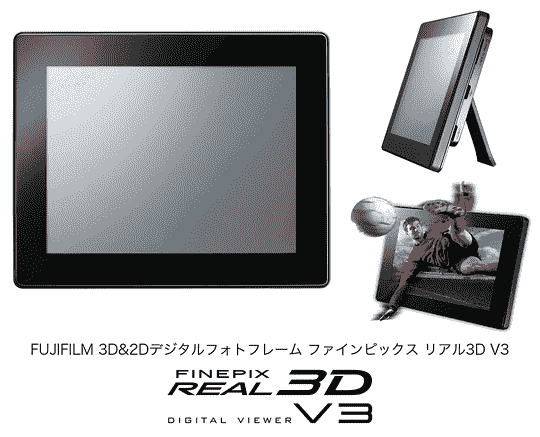

# FinePix REAL 3D V3:富士胶片的裸眼 3D 相框支持从其他设备进行 3D 播放 TechCrunch

> 原文：<https://web.archive.org/web/http://techcrunch.com/2011/11/01/finepix-real-3d-v3-fujifilms-naked-eye-3d-photoframe-supports-3d-playback-from-other-devices/>

# FinePix REAL 3D V3:富士胶片的裸眼 3D 相框支持其他设备的 3D 播放

如今，数码相框一毛钱一打，最近，3D 模型也不断涌现。Fujifilm 今天[宣布](https://web.archive.org/web/20230204144916/http://www.fujifilm.com/news/n111101.html)FinePix REAL 3D V3，这是一种所谓的“数字浏览器”，可以以 3D 方式显示图片，并且不需要用户戴眼镜。

该公司表示，其新设备是世界上第一个支持 3D 电影和图片播放并通过 HDMI 接口兼容其他 3D 设备(摄像机、游戏机、3D 蓝光播放器等)的设备。).

【T2

以下是 FinePix REAL 3D V3 的主要功能:

*   7.2 英寸裸眼 3D 液晶，最大 1600×600。分辨率(不用说，2D 显示器也是可能的)
*   LED 背光
*   720p 高清电影支持
*   立体声扬声器
*   512MB 内部内存
*   SD/SDHC 卡插槽，迷你 USB 端口
*   遥控

在日本，富士胶片计划从 11 月 12 日起以 640 美元的价格出售这款设备(英文新闻稿中没有提到国际销售计划)。