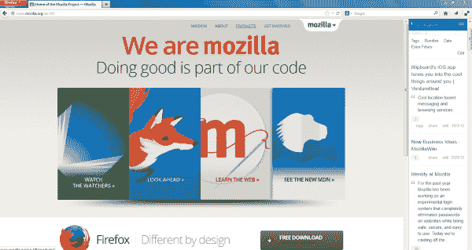

# Firefox 27 发布，改进了社交 API，支持 SPDY 3.1 

> 原文：<https://web.archive.org/web/https://techcrunch.com/2014/02/04/firefox-27-launches-with-improved-social-api-spdy-3-1-support/>

# Firefox 27 发布，改进了社交 API，支持 SPDY 3.1

Mozilla 今天[推出了](https://web.archive.org/web/20230129230522/https://www.mozilla.org/en-US/mobile/27.0/releasenotes/) Firefox 27。新版浏览器对火狐社交 API 进行了重大更新，现在支持老派的 Web 2.0 社交书签工具 [Delicious](https://web.archive.org/web/20230129230522/http://delicious.com/) 和印度音乐服务 [Saavn](https://web.archive.org/web/20230129230522/http://www.saavn.com/) 。更重要的是，社交 API 现在允许用户同时运行多个服务。

Firefox 的社交 API 旨在为社交网络服务、聊天工具和新闻网站提供一个持久的位置，在浏览器中弹出通知。它于 2012 年发布，去年 Mozilla 向开发者开放了它，尽管我从来没有得到公司竞相发布其社交 API 集成的印象。

不过，该服务的一个主要问题是，您一次只能运行一个集成，如果您坚持使用多个集成，就不得不在它们之间笨拙地切换。既然这个限制已经取消，我们可能会看到更多的集成投入使用。

该版本中唯一推出的其他主要新功能是支持 Google 的 SPDY 3.1 协议，并添加了[传输层安全](https://web.archive.org/web/20230129230522/http://en.wikipedia.org/wiki/Transport_Layer_Security) (TLS)版本 1.1 和 1.2。火狐的网络武器库。这些基本上是众所周知的 SSL 加密协议的继承者。

在 Android 上，Firefox 团队这次只做了几处改动。移动版本现在还支持 TLS 1.1 和 1.2，以及更易读的默认字体和一些小的用户界面改进。

