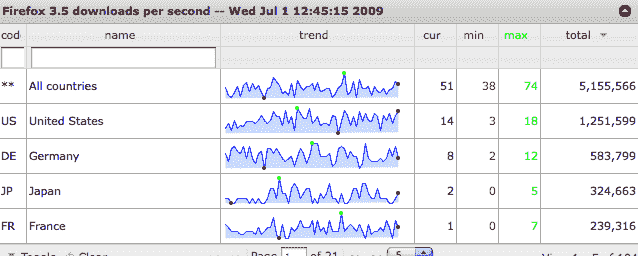

# 火狐 3.5 在 24 小时内达到了 500 万次下载。可敬，但不是记录。TechCrunch

> 原文：<https://web.archive.org/web/https://techcrunch.com/2009/07/01/firefox-35-hits-five-million-downloads-in-24-hours-respectable-but-not-a-record/>

# 火狐 3.5 在 24 小时内达到了 500 万次下载。可敬，但不是记录。

在昨天发布后的 24 小时内，火狐 3.5 已经被下载了超过 500 万次。(只用了几个小时[过百万](https://web.archive.org/web/20221206184655/http://www.beta.techcrunch.com/2009/06/30/firefox-35-soars-past-a-million-downloads-approaching-100-downloads-a-second/))。这当然是值得尊敬的，但与去年夏天 Firefox 3.0 掀起的热潮相比还是不太一样，当时 Firefox 3.0 创下了单日 830 万次下载的“世界纪录”。也许我们需要等待火狐 4.0 来打破这个记录。但是 Firefox 3.5 可能仍然会打破 Safari 4 在发布的前三天获得的 1100 万下载量。

《我们中的谁》拥有一些来自其追踪的大约 80 万互联网用户的实时使用统计数据。根据其数据，它估计 Firefox 3.5 已经获得了大约 2.4%的浏览器市场份额。总的来说，它把所有版本的 Firefox 放在 29%。这表明接近 10%的火狐用户已经升级了。它还认为 Safari 的市场份额只有 2.5%，这似乎很低。([其他数据](https://web.archive.org/web/20221206184655/http://en.wikipedia.org/wiki/Usage_share_of_web_browsers)显示接近 8%)。

看看我们自己的 TechCrunch Google Analytics，28%的火狐访客已经使用 3.5 版本，但我们的读者是火狐的忠实粉丝——近一半的访客使用某种版本的火狐，这一比例远高于大多数网站。

我已经使用 3.5 候选版本大约一周了。它比 3.0 更灵活，我已经沉迷于标签栏上的加号功能，这使得添加标签更容易。我喜欢开放视频标准的发展方向。当我打开太多标签的时候也有点不舒服，但是现在已经好多了。一些附加组件还不能工作，但没什么重要的。总的来说，这是一个更好的产品。